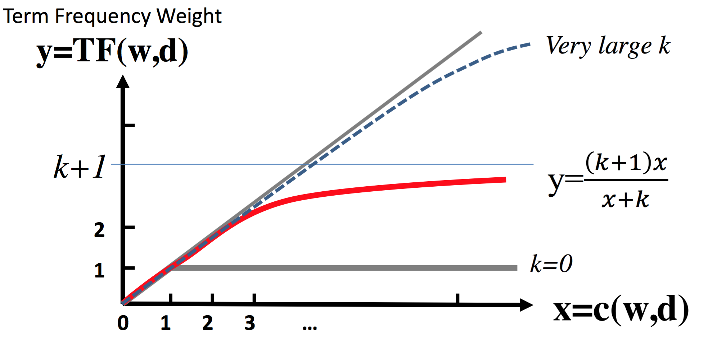
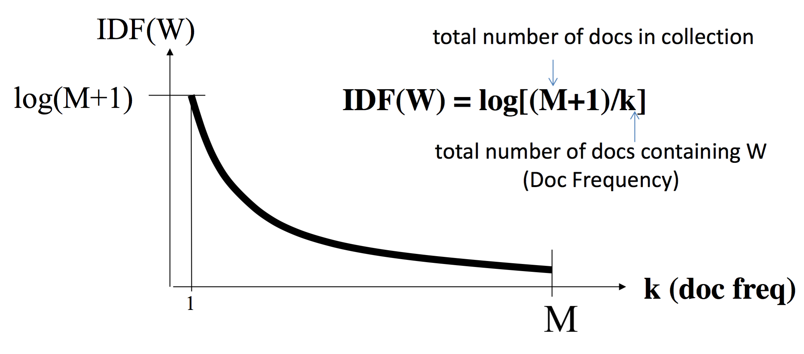

# Text Similarity

### State of the Art
* value for word $i$ in document vector: BM25$(w_i,D)$
* normalize length of each document vector to 1
* distance$(\vec x,\vec y)$ = $\sum_{i=1}^N\text{IDF}(w_i)\times x(i)\times y(i)$

Cosine usually works the best.

1. high-frequency sensitive measures: cosine, Jensen-Shannon, $\alpha$-skew, recall
2. low-frequency sensitive measures: precision
3. similar-frequency sensitive methods: Jaccard, Jaccard+MI, Lin, harmonic mean

$$
\operatorname{Jaccard}(X, Y) = \frac{X\cap Y}{X\cup Y}
$$

### BM-25: Term frequency weight
$$
\text{BM25}(w,D) = 
\frac{1+k}
{1+k/\left(
\frac{c(w)}
{1+b \left(|D| - |\bar D|\right) / |\bar D|} 
\right)}
$$

* $c(w)$: word count in document D
* $|D|$: document length
* $|\bar D|$: average document length
* parameter $k\in [0,\infty)$: set upper bound to $k+1$
* parameter $b\in [0,1]$: control length normalization

Illustration for $\frac{1+k}{1+k/x}$:


### IDF: Penalizing Popular Terms

### Code example

```python
import numpy as np
import scipy.sparse as sp
from sklearn.preprocessing import normalize

def BM25_IDF(X, k, b):
    """
    Args:
      X: sp.csr_matrix with shape (n_docs, V), count matrix 
      k: scalar, parameter for BM25
      b: scalar, parameter for BM25
    Returns:
      sp.csr_matrix with shape (n_docs, V)
    """
    X = sp.csr_matrix(X, copy=True)
    nrows, ncols = X.shape
    D_bar = X.count_nonzero() / nrows 
    X.data = float(k) / X.data
    coef = (np.diff(X.indptr) - D_bar) * b / D_bar + 1.0
    coef_diag = sp.spdiags(coef, diags=0, m=nrows, n=nrows, format='csr')
    X = coef_diag.dot(X)
    X.data = (1.0 + k) / (X.data + 1.0)
    X = normalize(X)
    df = np.bincount(X.indices, minlength=X.shape[1])
    idf = np.log(float(nrows) / (df + 1.0)) + 1.0
    idf = np.sqrt(idf) # take square root to match the similarity formula
    idf_diag = sp.spdiags(idf, diags=0, m=ncols, 
                          n=ncols, format='csr')
    X = X * idf_diag
    return X
```

### Reference
- Text Mining: [https://www.coursera.org/learn/text-mining](https://www.coursera.org/learn/text-mining)
- Weeds, J., Weir, D., & McCarthy, D. (2004). Characterising measures of lexical distributional similarity. In Proceedings of the 20th International Conference on Compu- tational Linguistics (COLING ’04), pp. 1015–1021. Association for Computational Linguistics.