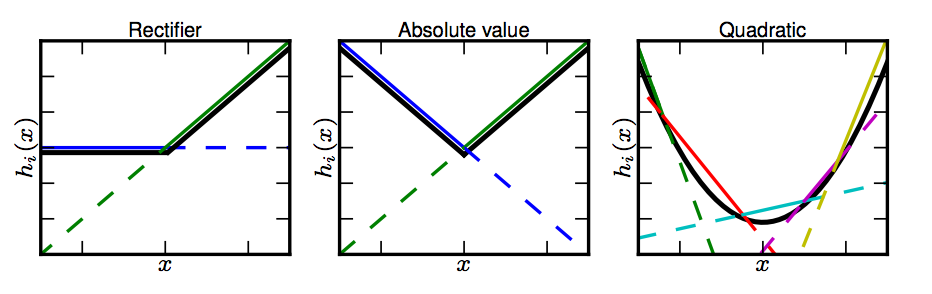

$f(\sum_iW_ix_i+b)\equiv f(z)$

### Sigmoid function
$$
f(z) = \frac{1}{1+\exp(-z)}
$$
whose derivative is $f'(z) = f(z) (1-f(z))$ ($=a(1-a)$ in implementation). The derivative of the softmax funtion is the same. 
An interesting property is $1-f(z) = f(-z)$ (which can be seen intuitively from the plot above).
### Hyperbolic tangent (rescaled sigmoid)
$$
\begin{align}
f(z) &= \tanh(z) = \frac{e^z - e^{-z}}{e^z + e^{-z}}\\\\
     &= 2\operatorname{Sigmoid}(2z)-1.
\end{align}
$$

whose derivative is $f'(z) = 1- (f(z))^2$ ($=1-a^2$ in implementation).
Hyperbolic tangent is better than sigmoid function in most cases. It resembles the identity function more closely which makes training the tanh network easier. Output of sigmoid is all positive, which makes the gradients of parameters either all postive or all negative (the parameter updates will have zig-zag path when the optimal direction is not all postive or all negative). This is why zero-center matters.

The widespread saturation of sigmoidal units can make gradient-based learning very difficult. For this reason, their use as hidden units in feedforward networks is now discouraged. However, in models holding additional requirements that rule out the use of piecewise linear activation functions, sigmoidal units are still appealing despite the drawbacks of saturation.

Another drawback of sigmoid/tanh is that $\exp$ is a bit computational expensive.

### Hard tanh
$$
\begin{align}
f(z)= 
\begin{cases} 
-1 \ &\mbox{if } x<-1 \\\\
0    &\mbox{if } -1<=x<=1\\\\
1    &\mbox{if } x>1
\end{cases}
\end{align}
$$
Hard tangent performs silimarly to tanh, but is computationally cheaper.

### Rectified linear function (ReLU)
(neither bounded nor continuously differentiable)
$$
f(z) = \max(0,x).
$$
Rectified linear units and all of these generalizations of them are based on the principle that models are easier to optimize if their behavior is closer to linear.
Combine with ReLu, it's better to initialize $W$ with identity matrix or its scaled version and initialize biases with zeros (starting from simple averaging). 
As a rule of thumb, ReLU units work better than tanh, and tanh works better than sigmoid.

### Generalizations of ReLU
#### Slope methods
$$
f(z)=\max(\alpha z,z)
$$

* Absolute value rectification: $\alpha=-1$, $f(z)=|z|$. It is used in object recognition from images, where it makes sense to seek features that are invariant under a polarity reversal of the input illumination
* Leaky ReLU: fix $\alpha$ to a small value like 0.01.
* Parametric ReLU (PReLu): treats $\alpha$ as a learnable parameter.

#### Exponential linear units (ELU)
$$
\begin{align}
f(z)= 
\begin{cases} 
x \ &\mbox{if } x\geq 0 \\\\
\alpha (e^x-1)    &\mbox{if }x<0
\end{cases}
\end{align}
$$

#### Maxout networks
$$
f(z) = \max_{j\in[1,k]}W_j^Tx+b_j.
$$
If $k=2$, it simplifies to 
$$
f(z) = \max(W_1^Tx+b_1, W_2^Tx+b_2)
$$

All slope methods are special cases of this form. The Maxout neuron therefore enjoys all the benefits of a ReLU unit (linear regime of operation, no saturation) and does not have its drawbacks (dying ReLU). However, unlike the ReLU neurons it multiplies the number of parameters for every single neuron, leading to a high total number of parameters.
### Indentical function
It's equivalant to compute:
$$
h = f(VUx+b)
$$
If $U$ produces $q$ outputs, then $U$ and $V$ together contain only $(n + p)q$ parameters, while $W$ contains $np$ parameters. For small $q$, this can be a considerable saving in parameters. It comes at the cost of constraining the linear transformation to be **low-rank**, but these low-rank relationships are often sufficient. Linear hidden units thus offer an effective way of reducing the number of parameters in a network.
### Last words for activation functions
It is very rare to mix and match different types of neurons in the same network, even though there is no fundamental problem with doing so.

"What neuron type should I use?" Use the ReLU non-linearity, be careful with your learning rates and possibly monitor the fraction of "dead" units in a network. If this concerns you, give Leaky ReLU/ Maxout/ELU a try. Never use sigmoid. Try tanh, but expect it to work worse than ReLU/Maxout.

### reference
- [Deep Learning Book](http://www.deeplearningbook.org/)
- [Stanford CS231n Lecture 6](http://cs231n.stanford.edu/slides/2017/cs231n_2017_lecture6.pdf)
- [Stanford CS224d Lecture 6](http://cs224d.stanford.edu/lectures/CS224d-Lecture6.pdf)
