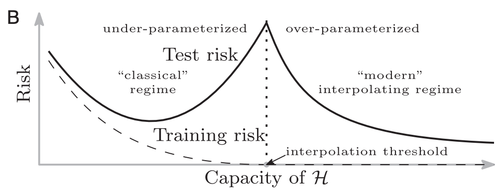
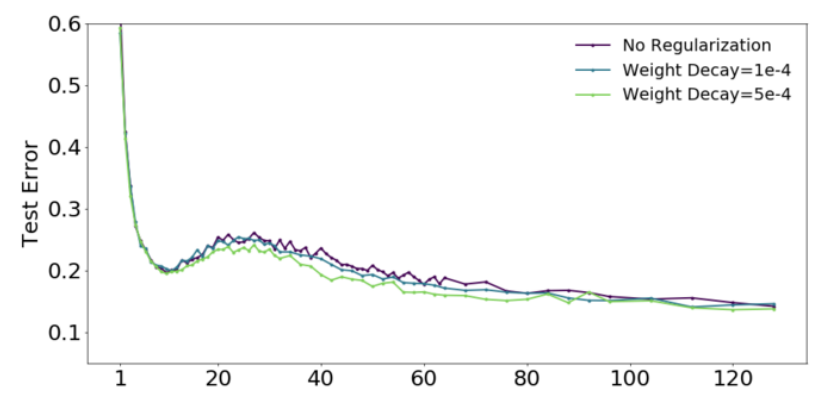
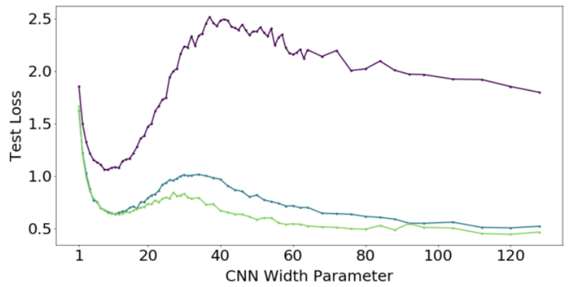

## Table of contents
<!--ts-->
   * [Projection](#projection)
   * [Embedding of Discrete Variables](#embedding-of-discrete-variables)
   * [Sequence Encoding](#sequence-encoding)
   * [Sequence Aggregation](#sequence-aggregation)
   * [Interaction](#interaction)
     * [Interaction of two vectors](#interaction-of-two-vectors) 
     * [Interaction of two sequences](#interaction-of-two-sequences)
   * [Meta Architecture](#meta-architecture)
   * [General Issues](#general-issues)
   * [Appendix](#appendix)
   * [Reference](#reference)
<!--te-->
## Projection
### dense layer/perceptron
$$
x'=\sigma(Wx+b)
$$
### highway layer
#### version 1
$$
\begin{align*}
z &= \operatorname{relu}(W_p x+b) \\\\
g &= \operatorname{sigmoid}(W_g x+b)\\\\
x'&=g\circ z + (1-g)\circ x
\end{align*}
$$
#### version 2
$$
\begin{align*}
z &= \tanh(W_1x + b_1) \\\\
r &= \operatorname{sigmoid}(W_2x + b_2)\\\\
f &= \operatorname{sigmoid}(W_3x + b_3)\\\\
x'&=r\circ x + f\circ z
\end{align*}
$$
### factorized bilinear layer
$$
x_i'=x^TF^TFx + Wx + b
$$
$F\in \mathcal{R}^{k\times d}$ ($k \ll d$). Dropout in factorized bilinear layer (DropFactor[9]): each **factor** is retained with a fixed probability $p$.
### neural arithmetic logic units
$$
\begin{align*}
W &= \tanh(\hat W) \odot \sigma(\hat M) \\\\
a &= Wx\\\\
m &= \exp W(\log(|x|+\epsilon))\\\\
g &= \sigma(Gx)\\\\
y &= g\odot a + (1 - g) \odot m
\end{align*}
$$
Elements of $W$ are biased to be close to −1, 0, or 1. $W$ for $a$ performs addition or substraction, while for $m$ it operates in log space and is therefore capable of learning multiplication, division and power functions. NALU functions in a way that extrapolates to numbers outside of the range observed during training [16].

### Maxout Networks
See [maxout networks](./activation.md#maxout-networks).
## Embedding of Discrete Variables
### Usage of pretrained embeddings
- fix
  - fix pretrained embeddings and train the outside-pretrained ones
  - fix pretrained embeddings and set others to zero (when pretrained embeddings have very high coverage)
  - fix pretrained embeddings and hash others to one of N random embeddings [4]
- make them trainable/finetunable
- fix embeddings and train a projection layer
- concat fixed and trainable embeddings [6]
- fix embeddings and train a highway layer [8]

When there're duplicated words in pretrained embeddings after some kind of normalization (conversion to lower case, NFD normalization, etc.):
- Use the embedding of the most frequent one
- Use the average of them [17]
- Use the one that strictly match the form after normalization

### Handle unknown categories/out-of-vocabulary words
What are treated as OOV
- outside pretrained
- document frequency < threshold

What to do with them
- set to zero (when unknown categories do not matter)
- use one learnable vector as the embedding of OOV
- hash to one of N random embeddings
- generate its embedding from contexts via meta learning [35]
### character/subword embeddings
- multi-filters convolutional network, an exmaple configuration is 5, 10, 15 with hidden size 50, 100, 150, respectively [23].
- embeddings of sub-word units (wordpieces) [31]. Using wordpieces gives a good balance between the flexibility of single characters and the efficiency of full words for decoding, and also sidesteps the need for special treatment of unknown words.

### categorical metadata
Usage:
- concatenate the embedding vector of metadata with the aggregated vector of text representations (missing lower-level dependencies; can be accelerated by simplifying to category-specific bias vectors when followed by a dense layer: $W[x;c_k] + b = Wx + b_k$) [36]
- use a categorical-specific weight for customized linear transformation: $\sum_c W^{(c)}\_k x + b$, can be used in embeddings projection(e.g. an affine transformation[36], or a tanh-activated dense layer with residual connections[38]), lower-level sequence encoder (like in LSTM cells) or higher level prediction layers[38].
- use a customized context vector in [attention pooling](#self-attention): $\sum_c x^T u^{(c)}\_k$ [37]

When the number of categories are large (like users/items), one can use a set of basis vectors and learn a distribution over the basis vectors for each category[38], to encounter the following limitations:
- the number of parameters is huge
- some categories do not have enough data to train (e.g. cold start for new items)

## Sequence Encoding
### Recurrent Neural Networks
#### LSTM
$$
\begin{align*}
i_t &= \sigma \left( W^{(i)}x_t + U^{(i)}h_{t-1}\right)\\\\
f_t &= \sigma \left( W^{(i)}x_t + U^{(i)}h_{t-1}\right)\\\\
o_t &= \sigma \left( W^{(o)}x_t + U^{(o)}h_{t-1}\right)\\\\
\tilde c_t &= \tanh \left( W^{(c)}x_t + U^{(c)}h_{t-1}\right)\\\\
c_t &= f_t \circ c_{t-1} + i_t \circ \tilde c_t \\\\
h_t &= o_t \circ \tanh(c_t)
\end{align*}
$$
$i_t$, $f_t$ and $o_t$ is called input gate, forget gate, output gate, respectively. $c_t$ is the internal memory cell and $h_t$ is the hidden state. Bias terms are omitted for clarity. Performance of vanilla LSTM is quite stable, while coupling input and forget gates ($i_t = 1 - f_t$) can be faster and perform equally well in some tasks [30].

#### GRU
$$
\begin{align*}
z_t &= \sigma \left( W^{(z)}x_t + U^{(z)}h_{t-1}\right)\\\\
r_t &= \sigma \left( W^{(r)}x_t + U^{(r)}h_{t-1}\right)\\\\
\tilde h_t &= \tanh \left( Wx_t + r_t\circ Uh_{t-1}\right)\\\\
h_t &=z_t\circ h_{t-1} + (1 - z_t)\circ\tilde h_t
\end{align*}
$$
$z_t$ is called update gate and $r_t$ is called reset gate. $\tanh$ is used to set the memory at the same scale and make the blending more stable. Bias terms are omitted for clarity. Some researches report no significant difference between GRU and LSTM[29], but others point out that GRU cannot do things like simple counting (see [this](http://phontron.com/class/nn4nlp2019/assets/slides/nn4nlp-05-rnn.pdf)).

### Convolutional Neural Networks
- vanilla 1D convolution. See [Appendix](#convolutional-neural-network).
- depthwise separable convolution: a depthwise convolution (a spatial convolution performed independently over each channel) followed by a pointwise convolution (1x1 convolution), without any internal activations. This is under the assumption that the mapping of cross-channels correlations and spatial correlations can be entirely decoupled and it's preferable not to map them jointly. [22]
- dilated convolution: fast, large context [27][28]
- convolve over ancestors and siblings in dependency trees [25]
- convolve over dependency graph [26]

### Disconnected Recurrent Neural Networks
The state at each step only depends on the previous $k-1$ words and the current word. This method incorporate the position invariance into RNN by disconnecting the information flow[13].

### Self-attention/Transformer
See [this tutorial](http://nlp.seas.harvard.edu/2018/04/03/attention.html).
### Positional Encoding
Positional encodings are useful for CNNs and attention based models, giving them a sense of position.
#### postional Embedding
Embed the obsolute position, and then concatenated or added [12] to the sequence encoding.
#### sinusoidal positional encoding
$$
\begin{align*}
E_{(p, 2i)} & = \sin(p/10000^{2i/d})\\\\
E_{(p, 2i+1)} & = \cos(p/10000^{2i/d})
\end{align*}
$$
where $p$ is the position and $i$ is is one of the hidden dimensions. The postional encoding is added to the sequence [19].
#### Distance-sensitive weights/bias
- multiply by hand-designed linearly decayed weight based on the distance [20]
- add learnable distance-sensitive bias, where distances greater than N share the same value [4]

## Sequence Aggregation
### Pooling
Pooling operators have no learnable parameters.
#### Max pooling
pad with -inf.
#### Mean pooling/summation
Pad with zeros, sum up and divide by actual sequence length
#### Min pooling
Mentioned in [14]. Pad with inf.
### Aggregation models
#### Self-attention 
The general form:
$$
\begin{align*}
\alpha_i &= \frac{\exp(e_i)}{\sum_i \exp(e_i)}\\\\
v &= \sum_i \alpha_i x_i
\end{align*}
$$
or [7]
$$
v = \sum_i \alpha_i \tanh(Wx+b)
$$
$e_i$ is the attention score of position $i$. There're various ways to compute $e_i$.
##### version 1
$$
e_i = Wx_i
$$
##### version 2
$$
e_i = \tanh(Wx_i + b)^Tu
$$
Trainable parameter $u$ is called the context vector. If $x$ is already normalized (e.g. when $x$ is the output of an LSTM or GRU), the linear transformation can be omitted($e_i = x_i^Tu$). You can have multiple context vectors to performed multi-view self-attention[7]. Note that $e_i$ does not need the addition of a bias vector, due to a property that softmax is invariant to constant offset: $\operatorname{softmax}(x) = \operatorname{softmax}(x + c)$ (see [softmax]((../machine%20learning/Softmax%20regression.md)))

Another form of self-attention does not normalize the attention scores [21]:
$$
v =
\sum_i\sigma(e_i)\odot\tanh(Wx_i + b)
$$

#### RNN
- RNN: last hidden vector
- BiRNN: concatenation of two last hidden vectors
- multi-layered RNN: concatenation of last hidden vectors in all layers
- mean/max pooling of all time steps of RNN/BiRNN [7]
#### CNN
- Self-Adaptive Hierarchical Sentence Mdoel (AdaSent)
- Hierarchical ConvNet[7]: concatenation of the max pooling of each convolutional layer's feature maps
#### Transformer
Append a special [CLS] token to the sequence. 
- Use the final hidden state of the [CLS] token as the aggregated vector.
- Concatenation of last $N$ hidden states of the [CLS] token.

### Aggregation with Context
#### RNN
Set the initial RNN hidden states by the context vector.
#### Attention
The context vector is denoted by $c$.
##### version 1
$$
e_i = v\tanh(Wx_i + Uc + b)
$$
##### version 2
$$
e_i = \tanh(Wx_i + b)^Tc
$$
#### version 3
Use bilinear weight $M$ [23] 
$$
e_i = cMx_i
$$
## Interaction
### Interaction of two vectors
- concatenation: [a, b]
- addition: a + b
- substraction: a - b, use |a - b| in symetric case
- element-wise multiplication: a \* b
- Element-wise Bilinear Matching [3]
- Neural tensor network [18]
$$
s(v_1, v_2) = u^T \tanh \left(
v_1^T M^{[1:k]}v_2 + V
\begin{bmatrix}
    v_1 \\
    v_2
\end{bmatrix}
+b
\right)
$$
$M^{[1:k]}\in \mathcal R^{d\times d\times k}$ is a tensor and the bilinear tensor product $v_1^T M^{[1:k]}v_2$ results in a vector $h\in \mathcal R^k$, where each entry is computed by one slice of the tensor $h_i=v_1^TM^iv_2$.

> Regular neural networks cannot represent multiplicative interactions (Being able to approximate something is not the same as represent it)[41]. So bilinear operation enrich the hypothesis space in a meaningful way.

### Interaction of two sequences
There're usually 4 steps in the interaction of 2 sequences, namely computing attention score, computing attention activation/normalization, computing the weighted average, and fusing the attended information with the original one. 

- attention score
  - inner product
  - complex-valued inner product (Hermitian product) [11]
  - cosine
  - concat-MLP (really slow and consuming huge memory, not recommended)
  - bilinear [10]
  - element-wise product + MLP [10]
  - substraction + MLP [10]
- attention activation/normalization
  - softmax
  - sparse attention (square-relu) [5]
- pooling
  - weighted average/alignment pooling
  - extractive pooling [11]: softmax(max(score, dim=1)) * a
- fusion: can use position-wise projection or sequence encoding here

If attention score is the inner product, the product should be scale by $\sqrt{1/d}$ to counteract a change in variance under the assumption that the two vectors are independent random variables. Softmax with large values will have extremely small gradients. \[19\]

The weighted sum can be scaled by $\sqrt{1/L}$ to counteract a change in variance \[12\]. Under the assumption that the attention scores are uniformly distributed (which is generally not the case but found to work well in some cases), the weighted sum can be scaled by $L\sqrt{1/L}$ [12].
### Segment-aware concatenation
2 sequences are concatenated into a longer single sequence so that any architecture for single-sequence processing can be applied. 

To mark the start/end of the sequences, usually a [SEP] token is inserted between the two or prepend and append to each sequence. 

Segment-aware concatention is often accompanied by positional embeddings, with monotonically increasing numbering [32] or independent numbering in each sequence[34]. 

To mark which segment a token is in:
- add a learnable segment embedding ([SEG-A] or [SEG-B]) to the original word embedding [32]
- relative segment encodings (if followed by transformers): use an embedding indicating whether two tokens are from the same segment in self-attention [33]

## Meta Architecture
### Residual Connection
$$
x_k = h(x_{k-1}) + x_{k-1}
$$
The summation can be multiplied by $\sqrt{0.5}$ to halve the variance, assuming that both summands have the same variance which is not always true but effective in some cases [12]. 

A variant is called "dense residual connection" with skip connections from each layer to all previous layers [24]:
$$
x_k = h(x_{k-1}) + \sum_{i=0}^{k-1} x_i
$$
### Highway Connection
See [highway layer](#highway-layer)
### Dense Connection
Input of next layer is the concatenation of outputs of all previous layers.
### Weighted Connection
$$
y = \gamma\sum_{l=0}^L\alpha_l h_l
$$
$\alpha$ are softmax-normalized weights and $\gamma$ allows the model to scale the entire vector [15].

## General Issues
### Model capacity
Unlike traditional machine learning, as models grow, their learning dynamics change, and they become less prone to overfitting[39].

Although this kind of "double descent" exists, big models still can benefit from regularisation techniques[40].

## Appendix
### Convolutional Neural Network
#### Motivation of convolution
Fully connected networks are computationally expensive when the number of input units is large. Locally connected networks, in which each hidden unit will connect to only a small contiguous region of pixels in the input, are feasible for high resolution images.
Natural images have the property of being ”stationary”, meaning that the statistics of one part of the image are the same as any other part. This suggests that the features that we learn at one part of the image can also be applied to other parts of the image, and we can use the same features at all locations. In other words, natrual images holds these two properties:
1. Locality: nearby pixels are more strongly correlated.
2. Translation invariance: meaningful patterns can occur anywhere in the image.

#### Convolution
The dimension after convolution is
$$
n = \lfloor\frac{n_{\text{prev}} - k + 2\times \text{pad}}{\text{stride}}\rfloor + 1,
$$
where $k$ is the kernel size. The receptive field of each hidden units is 
$$
((k - 1)\times n_{\text{layer}} + 1)^2
$$
The shape of $W$ is (k, k, n_prev, n). The shape of $b$ is (1, 1, 1, n).

If we apply "valid" padding, no padding is used. If we use "same" padding, the shapes before and after convolution are the same, which means left (and upper) padding is $\lfloor\frac{k-1}{2}\rfloor$ and right (and lower) padding is $\lfloor\frac{k}{2}\rfloor$. In "full" convolution, $k-1$ padding is added to each edge, so the output size is input\_size + kernel\_size - 1.

In 1d convolution where no future information should involve, one can set both left and right padding to $k-1$ and remove the last $k-1$ units after each convolution [12]. 

With kernel width $k$ and number of layers $l$, the network has a input field (perception field) of size $(k-1)\times l + 1$

By design, convnets are only robust against translation. **Data augmentation** makes them robust against other transformations: rotation, scaling, shearing, warping, ... Other solutions include group equivariant convnets (invariance to rotation), recurrence and attention (to exploit topological structure).

Ways to reduce complexity of vanilla convolution:
- depthwise convolutions
- separable convolutions
- inverted bottlenecks (MobileNetV2, MNasNet, EfficientNet)

#### Motivation of pooling
* Features obtained by convolution is still computationally challenging
* Aggregating statistics of features at various locations is a natural way to describe a large image
* Pooled features are "translation invariant", which means the same pooled feature will be active even when the image undergoes (small) translations.

#### Pooling
After obtaining our convolved features as described earlier, we decide the size of the region, say $m\times n$ to pool our convolved features over. Then, we divide our convolved features into disjoint $m\times n$ regions, and take the mean (or maximum) feature activation over these regions to obtain the pooled convolved features. These pooled features can then be used for classification. In max pooling, "-inf" (instead of 0) is used as the padded value.

#### Architecture
A CNN consists of a number of convolutional and subsampling layers optionally followed by fully connected layers. The architecture of a CNN is designed to take advantage of the 2D structure of an input image (or other 2D input such as a speech signal). This is achieved with local connections and tied weights followed by some form of pooling which results in translation invariant features.

#### Back Propagation
- **propagate error through a pooling layer**: The weight $W$ is $\frac{1}{mn}$ in mean pooling and 1 for the maximun, 0 for others in max pooling. The bias is 0. 
- **update weights in a convolutional layer**: convolve the iuput of the convolutional layer with the incoming error.

## Reference
- [1] http://deeplearning.stanford.edu/tutorial/
- [2] [Stanford CS224d Lecture 13](http://cs224d.stanford.edu/lectures/CS224d-Lecture13.pdf)
- [3] (SEM'18) [Element-wise Bilinear Sentence Matching](http://aclweb.org/anthology/S18-2012)
- [4] (EMNLP'16) [A Decomposable Attention Model for Natural Language Inference](https://arxiv.org/abs/1606.01933)
- [5] (NIPS'18) [GLoMo: Unsupervisedly Learned Relational Graphs as Transferable Representations](http://www.cs.cmu.edu/~bdhingra/papers/glomo.pdf)
- [6] [Sematic Sentence Matching with Densely-connected Recurrent and Co-attentive Information](https://arxiv.org/abs/1805.11360)
- [7] (EMNLP'17) [Supervised Learning of Universal Sentence Representations from Natural Language Inference Data](https://arxiv.org/abs/1705.02364)
- [8] (EMNLP'18) [A Compare-Propagate Architecture with Alignment Factorization for Natural Language Inference](https://arxiv.org/abs/1801.00102)
- [9] (ICCV'17) [Factorized Bilinear Models for Image Recognition](http://openaccess.thecvf.com/content_ICCV_2017/papers/Li_Factorized_Bilinear_Models_ICCV_2017_paper.pdf)
- [10] (IJCAI'18) [Multiway Attention Networks for Modeling Sentence Pairs](https://www.ijcai.org/proceedings/2018/0613.pdf)
- [11] (IJCAL'18) [Hermitian Co-Attention Networks for Text Matching in Asymmetrical Domains](https://www.ijcai.org/proceedings/2018/0615.pdf)
- [12] (ICML'17) [Convolutional Sequence to Sequence Learning](http://proceedings.mlr.press/v70/gehring17a.html)
- [13] (ACL'18) [Disconnected Recurrent Neural Networks for Text Categorization](http://aclweb.org/anthology/P18-1215)
- [14] (NIPS'17) [Learned in Translation: Contextual Word Vecotrs](http://papers.nips.cc/paper/7209-learned-in-translation-contextualized-word-vectors.pdf)
- [15] (NAACL'18) [Deep Contextualized word representations](http://aclweb.org/anthology/N18-1202)
- [16] [Neural Arithmetic Logic Units](https://arxiv.org/abs/1808.00508)
- [17] (ACL'17) [Reading Wikipedia to Answer Open-Domain Questions](http://www-cs.stanford.edu/people/danqi/papers/acl2017.pdf)
- [18] (NIPS'13) [Reasoning With Neural Tensor Networks for Knowledge Base Completion](https://nlp.stanford.edu/pubs/SocherChenManningNg_NIPS2013.pdf)
- [19] (NIPS'17) [Attention is All You Need](https://papers.nips.cc/paper/7181-attention-is-all-you-need.pdf)
- [20] (AAAI'18) [Multi-Entity Aspect-Based Sentiment Analysis with Context, Entity and Aspect Memory](https://www.aaai.org/ocs/index.php/AAAI/AAAI18/paper/download/17036/16171)
- [21] (ICLR'16) [Gated Graph Sequence Neural Networks](http://arxiv.org/abs/1511.05493)
- [22] (CVPR'17) [Xception: Deep Learning with Depthwise Separable Convolutions](https://arxiv.org/abs/1610.02357)
- [23] [Stochastic Answer Networks for Natural Languag Inference](https://arxiv.org/abs/1804.07888)
- [24] [Massive Exploration of Neural Machine Translation Architectures](https://arxiv.org/abs/1703.03906)
- [25] (ACL'15) [Dependency-based Convolutional Neural Networks for Sentence Embedding](https://www.aclweb.org/anthology/P15-2029)
- [26] (EMNLP'17) [Encoding Sentences with Graph Convolutional Networks for Semantic Role Labeling](https://www.aclweb.org/anthology/D17-1159)
- [27] [Neural Machine Translation in Linear Time](https://arxiv.org/pdf/1610.10099.pdf)
- [28] (EMNLP'17) [Fast and Accurate Entity Recognition with Iterated Dilated Convolutions](https://arxiv.org/pdf/1702.02098.pdf)
- [29] (NIPS'14 Workshop) [Empirical evaluation of gated recurrent neural networks on sequence modeling](https://arxiv.org/pdf/1412.3555.pdf)
- [30] (TNNLS'17) [LSTM: A Search Space Odyssey](https://arxiv.org/pdf/1503.04069.pdf)
- [31] [Google’s Neural Machine Translation System: Bridging the Gap between Human and Machine Translation](https://arxiv.org/pdf/1609.08144.pdf)
- [32] [BERT: Pre-training of Deep Bidirectional Transformers for Language Understanding](https://arxiv.org/pdf/1810.04805.pdf)
- [33] [XLNet: Generalized Autoregressive Pretraining for Language Understanding](https://arxiv.org/pdf/1906.08237.pdf)
- [34] [Cross-lingual Language Model Pretraining](https://arxiv.org/pdf/1901.07291.pdf)
- [35] [Few-Shot Representation Learning for Out-Of-Vocabulary Words](https://arxiv.org/pdf/1907.00505.pdf)
- [36] (ACL'15) [Learning semantic representations of users and products for document level sentiment classification](http://ir.hit.edu.cn/~dytang/paper/acl2015/acl2015.pdf)
- [37] (EMNLP'16) [Neural sentiment classification with user and product attention](https://aclweb.org/anthology/D16-1171)
- [38] (ACL'19) [Categorical Metadata Representation for Customized Text Classification](https://arxiv.org/pdf/1902.05196.pdf)
- [39] (NAS'19) [Reconciling modern machine learning practice and the bias-variance trade-off](https://www.pnas.org/content/pnas/116/32/15849.full.pdf)
- [40] [Deep Double Descent: Where Bigger Models And More Data Hurt](https://arxiv.org/pdf/1912.02292.pdf)
- [41] (ICML'19)[Multiplicative Interactions And Where To Find Them](https://openreview.net/pdf?id=rylnK6VtDH)
