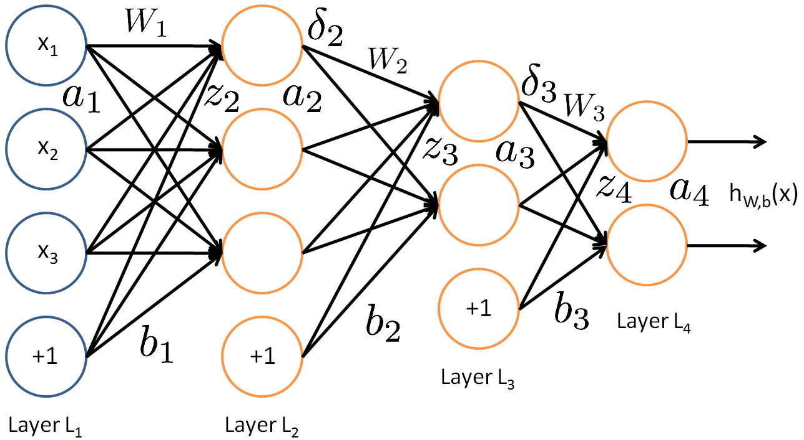

### Challenges Motivating Deep Learning
The curse of dimensionality: the number of possible distinct configurations of a set of variables increases exponentially as the number of variables increases.
With only the implicit prior of local constancy and smoothness regularization (which is commonly adopted in tradtional ML), to distinguish O(k) regions in input space, all of these methods require O(k) examples. When the number of data points is substantially small than the number of possible distinct configurations, the model is hard to generalize well.
The manifold hypothesis assumes that data lies along a low-dimensional manifold. In the context of AI tasks, such as those that involve processing images, sounds, or text, the manifold assumption is at least approximately correct: 
* Firstly, the probability distribution over images, text strings, and sounds that occur in real life is highly concentrated, occupying a very small volume in the total space. Sampling images or text uniformly at random can hardly yield meaningful results.
* Secondely, each example surrounded by other highly similar examples that may be reached by applying transformations to traverse the manifold.

Deep learning is one of the methods aiming to learn such a manifold structure.
### Intuition
A feed-forward network with linear output layer and at least one hidden layer with a "squashing" activation function (or a ReLU) can approximate any Borel measurable function from one finite dimensional space to another. The derivatives of the feedforward network can also approximate the derivatives of the function arbitrarily well. 

However, the theoretical result does not state how large the hidden layer should be (for a broad class of functions it's exponential to the number of input units), nor does it say anything about the learnability of the neural network. Besides, there is no universal procedure for examining a training set of specific examples and choosing a network that will generalize to points not in the training set.

Then why is "deep" learning? First, it's been proved that the number of linear regions carved out by a deep rectifier network grows exponentially with the number of layers. Second, choosing a deep model encodes a very general belief that the function we want to learn should involve composition of several simpler functions. This can be interpreted from a representation learning point of view. Empirically, greater depth does seem to result in better generalization for a wide variety of tasks (while other increases to the model size do not yield the same effect), which suggests that using deep architectures does indeed express a useful prior over the space of functions the model learns.

A online demo to interatively training your own neural network on a toy dataset with cool layer-by-layer visualization can be found in: 
* [ConvertJS](http://cs.stanford.edu/people/karpathy/convnetjs/demo/classify2d.html).
* [tensorflow playground](http://playground.tensorflow.org/)
* [Interactive Linear Classifier](http://vision.stanford.edu/teaching/cs231n-demos/linear-classify/)

### Model
Most common design involves the stacking of affine transformations followed by element-wise non-linearity.

Forward propagation:
$$
\begin{align}
z^{(l+1)} &= W^{(l)} a^{(l)} + b^{(l)}   \\
a^{(l+1)} &= f(z^{(l+1)})\\
h_{W,b}(x) &= a^{(n_l)}
\end{align}
$$
The input layer can be embeddings of raw entities, which can be treated as resulting from an "embedding layer" or "lookup layer". The weights of the output layer can be seen as embeddings of output classes.

### Further Reading
[Neural Network Architectures](https://culurciello.github.io/tech/2016/06/04/nets.html)

### Reference
- [Stanford CS224d Lecture 5](http://cs224d.stanford.edu/lectures/CS224d-Lecture5.pdf)
- Stanford CS231n: [Minimal net example](http://cs231n.github.io/neural-networks-case-study/)
- Stanford CS231n: [Neural Networks Part 1: Setting up the Architecture](http://cs231n.github.io/neural-networks-1/#intro)
- [Stanford Deep Learning Tutorial: Multi-Layer Neural Network](http://ufldl.stanford.edu/tutorial/supervised/MultiLayerNeuralNetworks/)
- [Deep Learning Book](http://www.deeplearningbook.org/)
