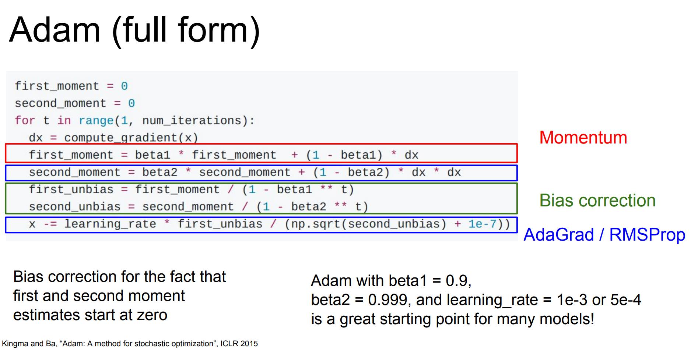
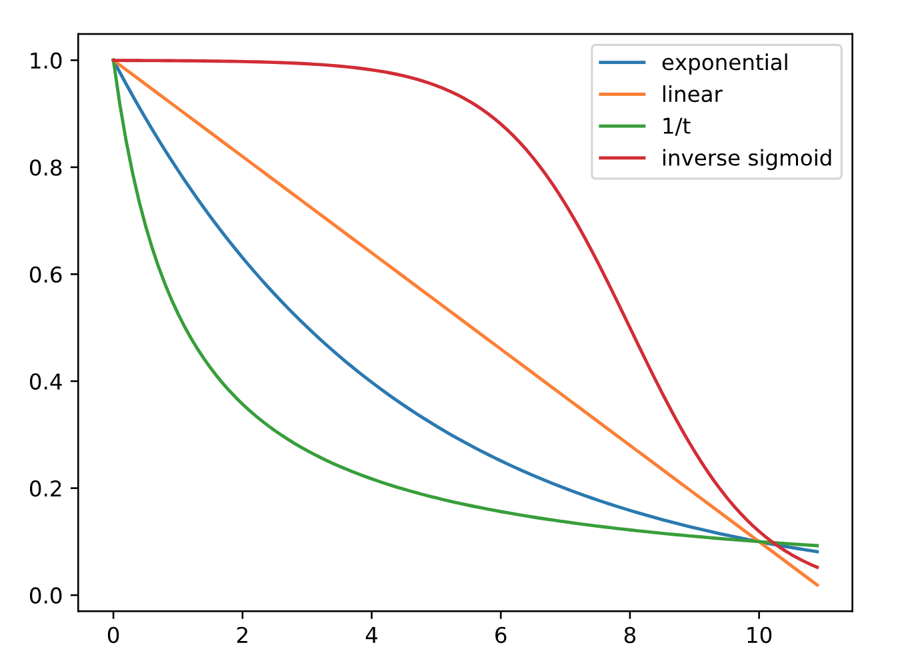
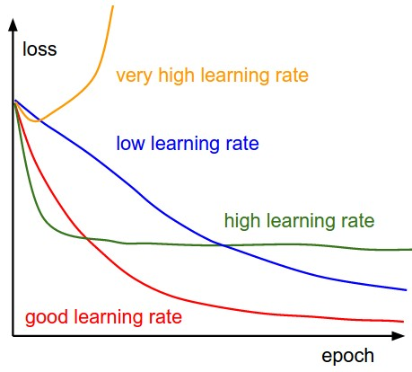

# Table of Contents
<!--ts-->
   * [Basics of Gradient Descent](#basics-of-gradient-descent)
   * [Initialization](#initialization)
   * [Optimization Algorithms](#optimization-algorithms)
   * [Learning Rate Scheduling](#learning-rate-scheduling)
   * [Normalization](#normalization)
   * [Regularization](#regularization)
      * [Dataset Argumentation](#dataset-argumentation)
      * [Early Stopping](#early-stopping)
      * [Dropout](#dropout)
   * [Other Issues](#other-issues)
      * [Vanishing and Exploding Gradients](#vanishing-and-exploding-gradients-in-deep-networks)
      * [Saturation and Dead Neurons](#saturation-and-dead-neurons)
      * [Issues for RNN](#issues-for-rnn)
      * [Model Ensemble](#model-ensemble)
      * [Tricks for batching](#tricks-for-batching)
   * [Reference](#reference)
      
<!--te-->

# Basics of Gradient Descent
The basic update rule for gradient descent in MLP:
$$
\begin{align*}
W_{ij}^{(l)} &= W_{ij}^{(l)} - \alpha \frac{\partial}{\partial W_{ij}^{(l)}} J(W,b) \\\\
b_{i}^{(l)} &= b_{i}^{(l)} - \alpha \frac{\partial}{\partial b_{i}^{(l)}} J(W,b)
\end{align*}
$$

where $\alpha$ is the learning rate. The **back propagation** algorithm gives an efficient way to compute these partial derivatives. The idea behind back propagation is that we can re-use derivatives computed for higher layers in computing derivatives for lower layers (in terms of back propagated error).
The computation of the partial derivative for a single example is as follows (and computation is usually parallelized):

1. Perform a feedforward pass, computing the activations for layers $L_2$, $L_3$, up to the output layer $L_{nl}$, using the equations defining the forward propagation steps
2. For the output layer (layer $n_l$), set $$ \delta^{(n_l)} =a^{(n_l)}-y$$
3. For $l=n_l−1,n_l−2,n_l−3,\dots,2$ (there's no "error" in input layer), set
   $$\delta^{(l)} = \left((W^{(l)})^T \delta^{(l+1)}\right) \bullet f'(z^{(l)})$$
4. Compute the desired partial derivatives for a single training example:

$$
\begin{align*}
\nabla_{W^{(l)}} J(W,b;x,y) &= \delta^{(l+1)} (a^{(l)})^T+\lambda W^{(l)}, \\\\
\nabla_{b^{(l)}} J(W,b;x,y) &= \delta^{(l+1)}.
\end{align*}
$$

The $\bullet$ denotes the element-wise product operator (also called the Hadamard product). The same extension goes for $f(\cdot)$ and $f'(\cdot)$. $\lambda$ is the regularization parameter. The partial derivatives are then sum up (and normalized by the number of training examples if they should match the cost function) to get the partial derivative w.r.t a whole batch (or minibatch). Since the back propagation is hard to implement and prone to tiny errors and bugs, remember to perform [gradient checking](http://ufldl.stanford.edu/wiki/index.php/Gradient_checking_and_advanced_optimization) after implementation. View [this](resources/gradient-checking.png) common asked question about gradient checking.

A clean python implementation and illustration for neural network can be found [here](resources/nn-implement.html).

# Initialization
Because of gradient-based optimization and early stopping, the final parameters are usually  close to the initial parameters. Initialization acts like some kind of prior. A general principle for initialization is to initialize with values close to 0. This prior says that it is more likely that units do not interact with each other than that they do interact. Units interact only if the likelihood term of the objective function expresses a strong preference for them to interact. In practice, it also prevents saturation of tanh units and thus accelerate convergence. 

Initialization methods for weights:
- a simple recipe: initialize all the parameters $\propto\mathcal N(0,\epsilon^2)$ for some small $\epsilon$, say 0.01
- He initialization (Kaiming initialization)
$$
W\propto \mathcal{N}(0, \alpha\sqrt{1/\operatorname{fan-in}})
$$
- [Xavier initialization](http://jmlr.org/proceedings/papers/v9/glorot10a/glorot10a.pdf) (Glorot initialization)
$$
W\propto \mathcal{N}(0,  \alpha\sqrt{2/(\operatorname{fan-in}+\operatorname{fan-out})})
$$

"fan-in" is the size of the previous layer and "fan-out" is the size of the next layer, which is equivalant to the number of rows and columns of this weight matrix. In He initialization, choosing fan-in preserves the magnitude of the variance of the weights in the forward pass. Choosing fan-out preserves the magnitudes in the backwards pass. The $\alpha$ is a gain value dependending on the following activation:

|activation|$\alpha$|
|---|---|
|identity|	1|
|sigmoid|	1|
|tanh|$5/3$|
|relu|$\sqrt{2}$|
|leaky relu|$\sqrt{2/(1+\text{slope}^2)}$|
|GLU|2|

Prove of the gain value for GLU can be found in [this paper](https://arxiv.org/abs/1705.03122).

There's a way to initialize parameters with equalized learning rate mentioned in [This paper](https://arxiv.org/abs/1710.10196). Weights are initialized trivially by $\mathcal{N}(0,1)$ and explicitly scaled by the normalization constant from He's innitializer at runtime. In adaptive SGD methods like RMSProp or Adam, it ensures the scale-invariance, so the learining spped is the same for all weights. 

The bias term is usually set to zero, with the following exceptions:
* Set the bias of a ReLU hidden unit to 0.1 rather than 0 to avoid saturating the ReLU at initialization.
* It is often beneficial to initialize the bias to obtain the right marginal statistics of the output. We can set the bias vector $b$ by solving the equation $\operatorname{softmax}(b) = c$, where $c$ is the marginal distribution of the classes.
* Set proper biases for gate units to "open" it at the beginning, otherwise units behind the gate do not have a chance to learn.

Unsupervised pre-training, supervised training on a related (or even unrelated) task are also good choices for initialization. In this case our prior specifies which units should interact with each other, and how they should interact. Some of these initialization strategies may yield faster convergence and better generalization than random initialization because they encode information about the distribution in the initial parameters of the model. They also benefits from larger initial weights, which will yield a stronger symmetry breaking effect, helping to avoid redundant units, and help to avoid losing signal during forward or back-propagation through the linear component of each layer.

For embeddings, one will often use the random initialization approach to initialize the embedding vectors of commonly occurring features, such as part-of-speech tags or individual letters, while using some form of supervised or unsupervised pre-training to initialize the potentially rare features, such as features for individual words. If you have little task-specific training data, or poor coverage of the vocabulary, it's better to fix the embedding and rely on task-specific projections to capture information salient to the task (pretrained word embeddings can be found in [Pre-trained word vectors for 294 languages](https://github.com/facebookresearch/fastText/blob/master/pretrained-vectors.md).

# Optimization Algorithms
On smaller datasets (or a small optimization problem like neural style transfer) L-BFGS or Conjugate Gradients win. On large datasets, mini-batch SGD usually wins over all batch methods.
Typical size of each mini batch : 20 to 1000. If full-batch training is affordable, use L-BFGS. If mini-batch is the case, Adam is the most common choice. Other choices includeSGD with momentum, RMSProp, AdaDelta and so on.

Adam is the abbreviation for "adaptive moment estimation".Because $(1-\epsilon)^{1/\epsilon} \approx 1/e$, if beta1=0.99, it takes $1/(1-0.99)=100$ iterations to make the first_moment small enough (<37% of the original value). The first_moment acts as exponential weighted averages of derivatives, and the second_moment aims to damp out the value in the oscillating directions. In practice, beta1 and beta2 are rarely tuned, while different choices of the learning rate (and learning rate scheduling) may affect the optimization process in a more noticable way.

# Learning Rate Scheduling
Most mini-batch optimization algorithms have the learning rate hyperparameter. Strategies include fixed learning rate, learning rate decay, cyclic learning rate (with snapshot ensemble). Common learning rate decay schemes:
- exponential decay
$$
\alpha=\alpha_0\mathrm{e}^{-kt}\ (k>0)
$$
or 
$$
\alpha=\alpha_0 k^t\ (k<1)
$$

- linear decay
$$
\alpha = \max(\epsilon, \alpha_0(1-kt))
$$
$\alpha_0\epsilon$ is the minimun amount of learning rate.

- 1/t decay
$$\alpha=\alpha_0/(1+kt)$$
In the definitions above, $k$ is called the decay rate and $t$ is the number of epochs.

- Inversed sigmoid decay
$$
\alpha = \frac{\alpha_0}{1+\exp ((t-m)/k)}
$$
The learning rate decays more slowly with larger $k$.

When decaying to 10% after 10 decays:

 

In pratice, the above decay schemes are often implemented step-wise:
$$
t = \lfloor i/T\rfloor
$$
where $i$ is the number of updates (or "global step"), and $T$ is the step size. If the size of data is small, $t$ can be set to the number of epochs.

- slanted triangular learning rates 
The learning rate quickly increases to a relatively large value and then slowly decrease, allowing the model to quickly converge to a suitable region of the parameter space in the beginning of training and then refine its parameters. It is described in [this paper](https://arxiv.org/abs/1801.06146).
- warmup/slow start 
Shrink the initialized learning rate by a tenth and gradually increases the learning rate to the regular level in several epochs (e.g. 3 epochs). This treatment learns a good initialization and is beneficial for converging. ([reference](https://arxiv.org/pdf/1611.05709.pdf))
- decay on plateau 
Decay by a constant factor when the validation score does not increase for an epoch or N epochs.

Relation between the learning rate and convergence:

 

Other optimization strategies and meta-algorithms, like supervised pretraining, curriculum learning, etc. can be found in section 8.7 (Page 322/PDF 337) of Deep Learning Book.

# Normalization
**Batch normalizaion** is a standard strategy for optimization. Let $H$ be a minibatch of activation of a layer, we replace it with
$$
H' = \gamma\frac{H-\mu}{\sigma}+\beta
$$
At training time, we set
$$
\mu = \frac{1}{m}\sum_iH_i
$$
and
$$
\sigma=\sqrt{\varepsilon+\frac{1}{m}\sum_i \left(H-\mu\right)_i^2},
$$
where $\varepsilon$ is a small positive value (e.g. $10^{-8}$) to avoid undefined gradient. All the 4 parameters ($\mu, \sigma, \gamma, \beta$) are trainable during back propagation. At test time, we use the exponentially weighted averages of means and variances.

The gradient tells how to update each parameter, under the assumption that the other layers do not change. In practice, we update all of the layers simultaneously. The effect of an update to the parameters for one layer depends so strongly on all of the previous layers and unexpected results can happen because of this (this is called "covariate shift"). Batch normalization acts to standardize the mean and variance of each unit in order to stabilize learning, while allowing the relationships between units and the nonlinear statistics of a single unit to change. The new parameters $\gamma$ and $\beta$ have much lower learning dynamics, because they are not determined by a complicated interaction between the parameters in the previous layers. The estimation of mean and variance is based simply on a mini-batch and is not accurate. This adds some noise to the $z$ values and has a slight regularization effect (the larger the batch size, the smaller the regularization effect). With batch normalization, the model can have higher learning rates, more resiliant training, and less need for dropout.

**Instance normalization** can be seen (and implemented) as batch normalization with batch size 1 and dimension $m\times d$, except that running average and variance originally in the same dimension are collected together and copied to corresponding dimensions when a new batch comes.

**Weight normalization** reparameterizes each weight as
$$
W = g\frac{V}{\|V\|}
$$
where $W,\ V\in \mathcal{R}^{m\times n}$, $g\in \mathcal{R}^{m\times 1}$.

# Regularization
A visualization of training/validation error with time is helpful for diagnostics. When the training error keeps going down, even &lt;1%, and the validation error gets stuck, it's likely that the model is memorizing all the training data and is overfitting.

* Simple first step: Reduce model size by lowering number of units and layers and other parameters
* large learning rate and small batch size also have regularization effects
* Standard L1 or L2 regularization on weights ($\lambda$ can be different on different layers if the computational cost is acceptable). L2 regularization is also called "weight decay" because parameters will be multiplied by $1-\alpha\lambda/m$ after each update ($\alpha$ is the learning rate and $m$ is the batch size).
* Constrain L2 norms of weight vectors to fixed number $s$. If $\|W\|_2^2>s$, then rescale it so that $\|W\|_2^2=s$.
* Sparse activation by L1 regularizer.
* Collect more data or use dataset augmentation (discussed later)
* Label smoothing for cross entropy loss.
* Early Stopping (discussed later)
* If the network is small, ensemble multiple (e.g 5) networks
* Dropout (discussed later)

The amount of regularization must be balanced for each dataset and architecture. For example, when learning rate is increased, other forms of regularization should be appropriately reduced. A large weight decay can be used for small dataset, but a small or even no weight decay is best for very large datasets and complex architectures.

## Dataset Argumentation
* Easiest for classification: apply (hand-designed) transformations that would not change the correct class. It's something you should always do. Just a matter of what kind and how much.
* Injecting noise in the input or the hidden units can also be seen as a form of data augmentation. (The dropout algorithm is the main development of this approach.) But injecting noise in the input is mostly not a good idea because it causes direct information loss.
* Adding noise to the weights can be interpreted as a stochastic implementation of a Bayesian inference over the weights, which reflect the uncertainty of a probability distribution. It can also be interpreted as pushing the model to points that are not merely minima, but minima surrounded by flat regions. It has been shown to be an effective in the context of RNN.

## Early Stopping
Save parameters after each, say 3 epochs (or 1/3 epoch for a large dataset like ImageNet) and use parameters that give best validation error. To reuse data in validation set, there are 2 strategies:
* initialize the model again and retrain on all of the data for the same number of steps determined by early stopping (not optimal).
* keep the parameters and continue training using all of the data until the average loss function on the validation set falls below the value of the training set objective when early stopping (not guaranteed to terminate).

## Dropout
### How
#### original version
* Training time: at each instance of evaluation, randomly set $p\in [0,1]$ of the neurons to 0.
* Test time: scale the model weights, multiply them by $p$.
#### inverted dropout
* Training time: at each instance of evaluation, randomly set $p\in [0,1]$ of the neurons to 0, and scale the outputs by a factor of $1/(1-p)$.
* Test time: compute an identity function.
### Why
* This prevents feature co-adaptation: A feature cannot only be useful in the presence of particular other features.
* In a single layer: A kind of middle-ground between Naïve Bayes (where all feature weights are set independently) and logistic regression models (where weights are set in the context of all others).
* It can be seen as a process of constructing new inputs by multiplying by noise (data augmentation)
* Can be seen as a form of model bagging (but not quite the same): training a network with stochastic behavior and making predictions by averaging (with weight sharing). A multi-layer perceptron with dropout applied at every layer can be interpreted as Bayesian model averaging. When applied to linear models, dropout is equivalent to L2 weight decay.

### Tips
* Because dropout is a regularization technique, it reduces the effective capacity of a model. To offset this effect, the size of the model and the number of iterations should be larger. For very large datasets, regularization confers little reduction in generalization error.
* If the training accuracy is always lower than the validation accuracy, you may regulate too much and the model goes underfitting. Try reducing the dropout rate or removing dropout in early layers (Since the general rule of thumb is to gradually increase dropout rate from beginning to end). When finetuning a model with the dropout rate adjusted, relevant weights should be rescaled. If the implementation is "inverted dropout" (e.g. in Keras), there's no need to adjust the weights.
* For networks containing recurrent units, do not apply dropout on recurrent connections. (for design of recurrent dropout mask, refer to [Baysian Dropout](https://arxiv.org/abs/1512.05287), NIPS 2016)
* When extremely few labeled training examples are available, dropout is less effective. Unsupervised feature learning can gain an advantage over dropout.
* multiplying the weights by $\mu\sim N(1,\sigma)$ (instead of a stochasitic binary vector) is another possible choice

# Other Issues
## Vanishing and Exploding Gradients in Deep Networks
Vanishing gradients result in slow convergence. A live code illustration for vanishing gradient problem can be found [here](resources/vanish.html).
Dealing with the vanishing gradients problem is still an open research question. Solutions include:
* making the networks shallower
* step-wise training
* specialized architectures that are designed to assist in gradient flow (e.g. LSTM & GRU)

Exploding gradients can be easily and effectively solved by gradient clipping.
## Saturation and Dead Neurons
If your network does not train well, it is advisable to monitor the network for layers with many saturated or dead neurons.
It matters for non-linearities that flatten in higher regimes (softmax, sigmoid, tanh etc.) to normalize all inputs magnitude-wise (be cautious to check this when using word vectors). Large-magnitude inputs will cause the non-linearity units to saturate. At saturation regimes the gradient is close to zero. The model will not learn effectively as the error would not propagate.
Solutions for saturation:
* changing the initialization
* scaling the range of the input values
* changing the learning rate
* normalize the values in the saturated layer after the activation (effective but expensive in terms of gradient computation)

Layers with the ReLU activation cannot be saturated, but can “die” – most or all values are negative and thus clipped at zero for all inputs, resulting in a gradient of zero for that layer. This can happen after a large gradient update. 
Solutions for dead neurons:
* changing the initialization
* reducing the learning rate

## Issues for RNN
* Long range dependencies -> vanishing (or exploding) gradients: additive gated architectures (LSTM, GRU..)
* Increasing the size of the recurrent layer cost a quadratic slow down: deep RNN in both direction scales linearly
* Large vocabularies -> slow softmax calculations: factorising the softmax or sampling

## Model Ensemble
- train N models independently and average the output
- snapshot ensemble
- Polyak averaging: keep a moving average of the parameters and use that at test time

## Tricks for batching
There're several tricks to speed up training (while barely affect the learning process) when preparing samples in batches for sequential data.
- sort by sequence length, make batches and just shuffle these batches. ([examples in DrQA](https://github.com/facebookresearch/DrQA/blob/50d0e49bb77fe0c6e881efb4b6fe2e61d3f92509/scripts/reader/train.py#L436))
- bucket by sequence lengths, shuffle samples in bucket and add each bucket ([examples in CSRAN](https://github.com/vanzytay/EMNLP2018_NLI/blob/master/train_acc.py#L588))

# Reference
- [1] [Stanford CS231n Lecture 6](http://cs231n.stanford.edu/slides/2017/cs231n_2017_lecture6.pdf)
- [2][Stanford CS231n Lecture 7](http://cs231n.stanford.edu/slides/2017/cs231n_2017_lecture7.pdf)
- [3] [Stanford CS224d Lecture 6](http://cs224d.stanford.edu/lectures/CS224d-Lecture6.pdf)
- [4] [Stanford CS224d Lecture 8](http://cs224d.stanford.edu/lectures/CS224d-Lecture8.pdf) ([Vanishing gradient example](http://cs224d.stanford.edu/notebooks/vanishing_grad_example.html))
- [5] [Stanford CS224d Midterm Solutions](http://cs224d.stanford.edu/midterm/midterm_solutions.pdf)- 
- [6] [Oxford Deep NLP 2017 Lecture 4](https://github.com/oxford-cs-deepnlp-2017/lectures/blob/master/Lecture%204%20-%20Language%20Modelling%20and%20RNNs%20Part%202.pdf)
- [7] [Random Search for Hyper-Parameter Optimization](http://www.jmlr.org/papers/volume13/bergstra12a/bergstra12a.pdf)
- [8] [A primer on neural network models for natural language processing](http://arxiv.org/pdf/1510.00726)
- [9] [Deep Learning Book](http://www.deeplearningbook.org/)
- [10] [deeplearning.ai Course 2: Hyperparameter tuning, Regularization and Optimization](https://www.coursera.org/learn/deep-neural-network/home/welcome)
- [11] [A disciplined approach to neural network hyper-parameters: Part 1 -- learning rate, batch size, momentum, and weight decay](https://arxiv.org/abs/1803.09820)

