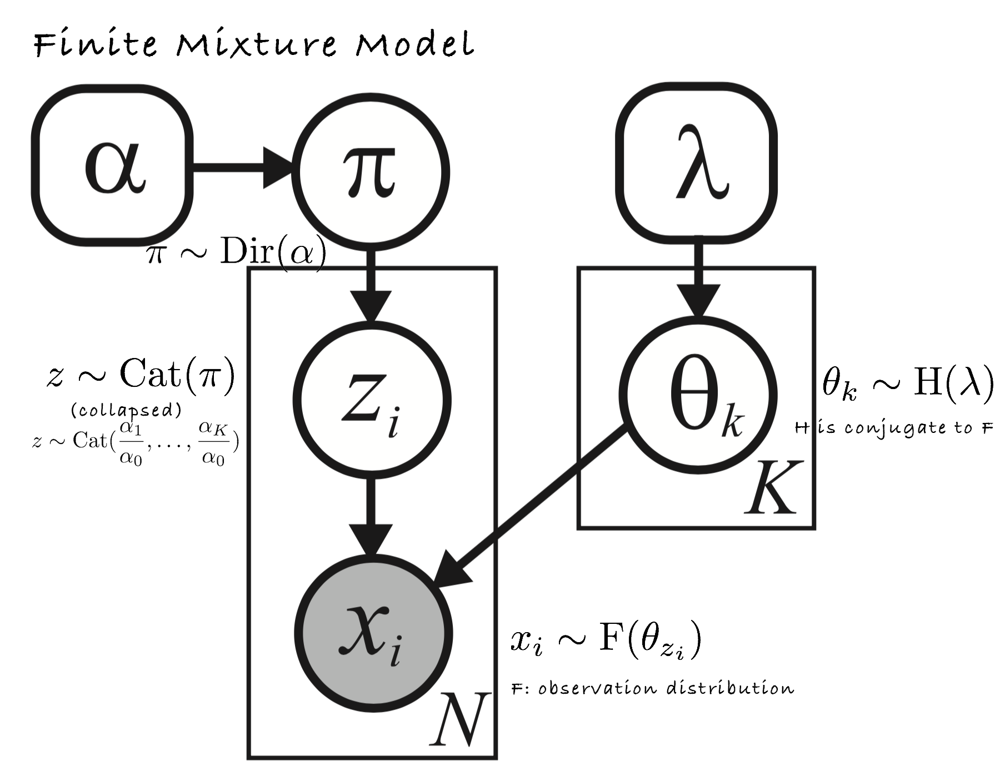
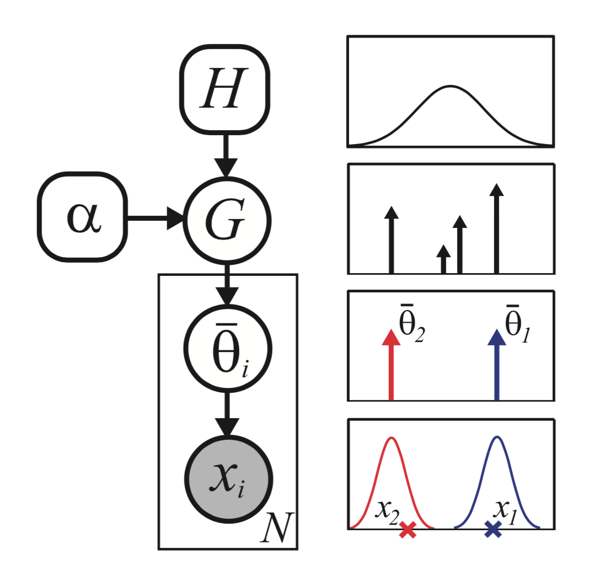
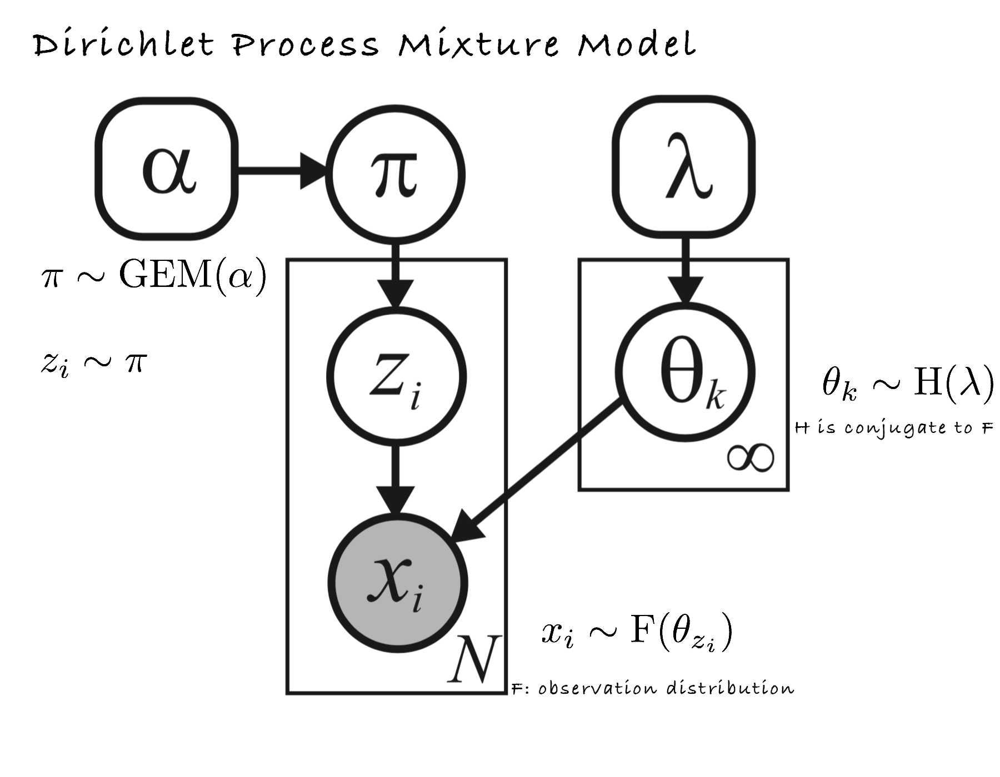
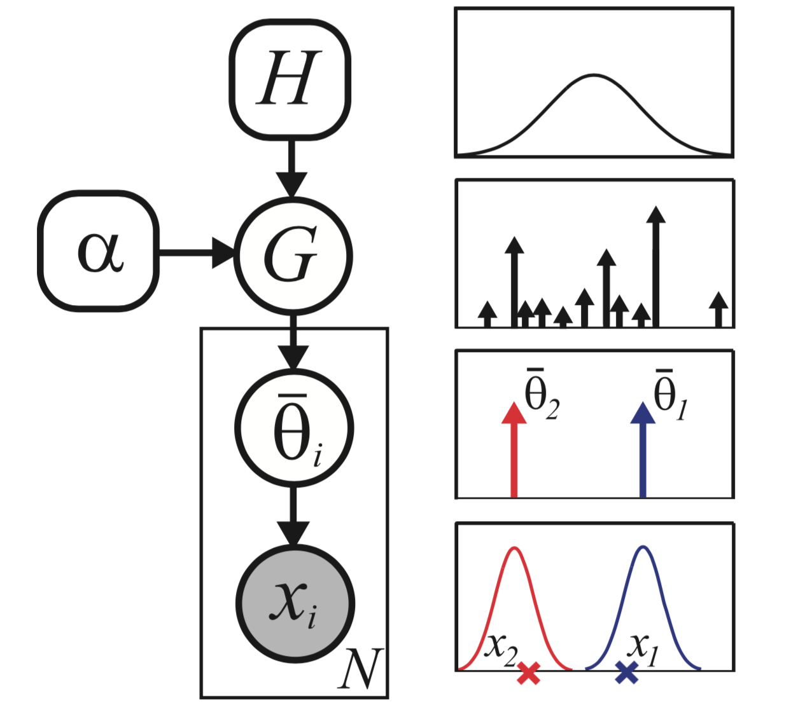

# Dirichlet Process Mixture Model

### Start from finite mixture model...
Traditional representation:
<div align="center">

</div>
Another representation (in which H and F are both Gaussian):
<div align="center">

</div>
where parameters are sample from G, a **discrete measure** of $H$:
$$
G(\theta)=\sum_{k=1}^K\pi_k\delta_{\theta_k}(\theta)
$$
and $x_i\sim \operatorname{F}(\bar \theta_i)$.
### DPMM
<div align="center">

</div>
$\pi\sim\operatorname{GEM}(\alpha)$ is the stick-breaking construction:
$$
\begin{align*}
\beta_k&{}=\operatorname{Beta}(1,\alpha)\\\\
\pi_k&{}=\beta_k(1-\sum_{l=1}^{k-1}\pi_l)
\end{align*}
$$

Another representation:
<div align="center">

</div>
Where $G$ is a random measure $G\sim\operatorname{DP}(\alpha,H)$:
$$
G(\theta)=\sum_{k=1}^\infty\pi_k\delta_{\theta_k}(\theta)
$$
One can show that the GEM process will terminate with probability 1, which means samples from a DP are discrete with probability 1. As $N\to\infty$, $K\to\alpha\log(N)$, showing that the model complexity will indeed grow logarithmically with dataset size.

### model fitting (Gibbs sampling)
$$
p(z_i=k|  z_{-i},x,\alpha,\lambda)\propto p(z_i=k| z_{-i},\alpha)\ p(x_i| x_{- i,k},\lambda)
$$
$$
p(z_i=k| z_{- i},\alpha)=
\begin{cases}
\frac{N_{k,-i}}{\alpha+N-1}
&\text{if k has been seen before}\\\\
\frac{\alpha}{\alpha+N-1}
&\text{if k is a new cluster}
\end{cases}
$$
$$
p(x_i| x_{- i,k},\lambda)=\frac{p(x_i, x_{- i,k}|\lambda)}{p( x_{- i,k}|\lambda)}
$$
where $p(x_i, x_{- i,k}|\lambda)$ is the marginal likelihood of all the data assigned to cluster $k$, including $i$, and $p(x_{−i,k}|\lambda)$ is an analogous expression excluding $i$.
### Example: DPMM algorithm for clustering:
```
Random initial assignment to clusters
loop
  unassign an observation
  choose new cluster for that observation
until convergence
```
Gibbs sampling for choosing cluster:
$$
p(\left.z_i=k\right|z_{-i},x,\alpha)=
\begin{cases}
\left(\frac{N_k}{N+\alpha}\right)\mathcal N\left(x,\frac{N_k\bar x}{N_k+1},1\right)&\text{existing cluster k}\\\\
\frac{\alpha}{N+\alpha}\mathcal N(x,0,1) &\text{new cluster}
\end{cases}
$$
on the assumption that base distribution G is normal distribution with zero mean and unit variance. $\mathcal N(x,\mu,\Sigma)$ is the probability of generate $x$ from a Gaussian with mean $\mu$ and variance $\Sigma$.

### Reference
- "Machine Learning" Lecture 17: [http://www.umiacs.umd.edu/~jbg/teaching/CSCI_5622/](http://www.umiacs.umd.edu/~jbg/teaching/CSCI_5622/)
- Book: Machine Learning - A Probabilistic Perspective(Chapter 25)
