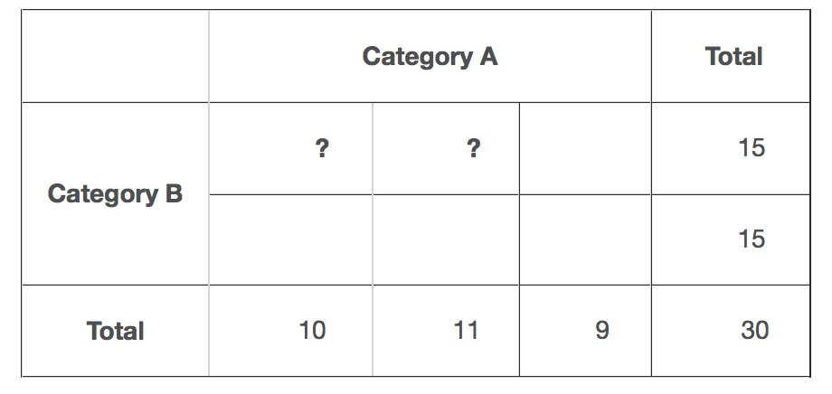

# Independence Test

To test the independence of two sequences. For theoretical details, see [this page](https://en.wikipedia.org/wiki/Chi-squared_test).
API usage:
```python
import pandas as pd
import scipy.stats as stats

def independence_test(seq_1, seq_2):
    crosstab = pd.crosstab(seq_1, seq_2)
    chi_square_statistics, p_value, degrees_of_freedom, expected_counts = stats.chi2_contingency(observed=crosstab)
    print('chi square statistics: %f' % chi_square_statistics)
    print('p value: %f' % p_value)
    print('degrees of freedom: %d' % degrees_of_freedom)
    print('expected_counts')
    print(expected_counts)
    print('actual_counts')
    print(pd.crosstab(seq_1, seq_2, margins=True))
```

The **Chi-square statistics** easures how well the observed distribution of data fits with the distribution that is expected if the variables are independent.
$$
\chi ^{2}=\sum{\frac {({\text{observed}}-{\text{expected}})^{2}}{\text{expected}}}
$$
The **P value**, is the probability of finding the observed or more extreme results when the null hypothesis ($H_0$) is true (which means the two observations are independent).
**Degrees of freedom** is simply $(\text{nrows}-1)\times(\text{ncols}-1)$  (nrows and ncols refer to the number of rows and columns of the cross table).



The **expected counts** are the expected observations when the two sequences are independent.

### References
- [Chi-squared test - Wikipedia](https://en.wikipedia.org/wiki/Chi-squared_test)
- [Python for Data Analysis Part 25: Chi-Squared Tests | Life Is Study](http://hamelg.blogspot.com/2015/11/python-for-data-analysis-part-25-chi.html)
- [What Are Degrees of Freedom in Statistics?](http://blog.minitab.com/blog/statistics-and-quality-data-analysis/what-are-degrees-of-freedom-in-statistics)


