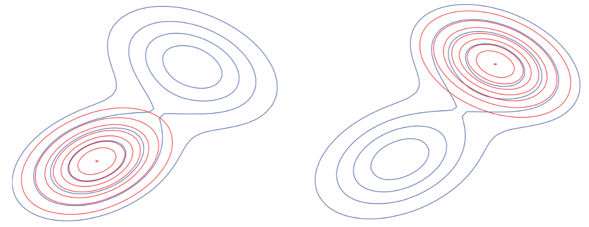
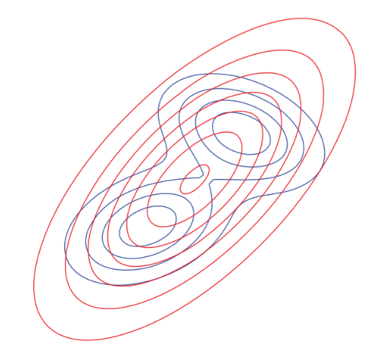
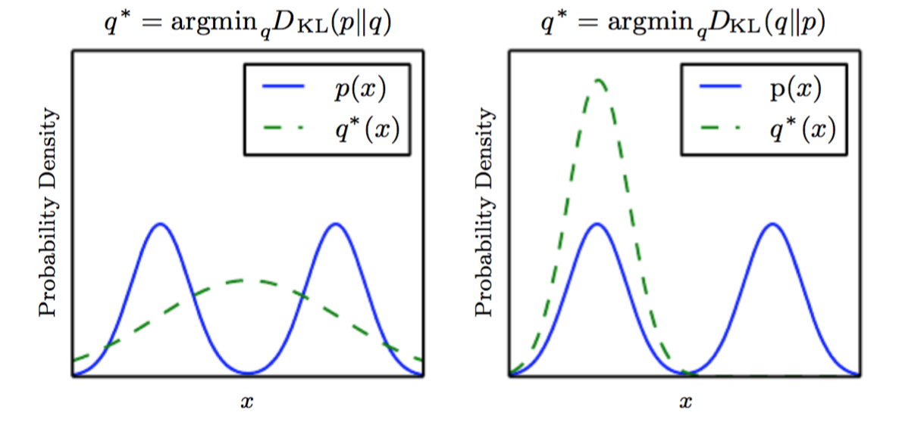
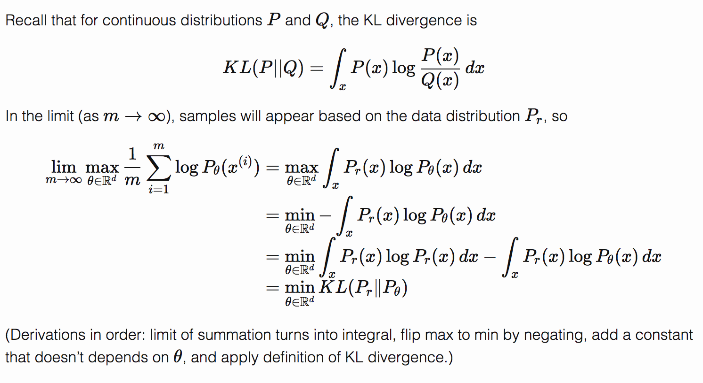

# KL Divergence

Also called “information gain", is a measure of the difference between two probability distributions P and Q. It is not symmetric and does not obey the triangle inequality, thus is not a true metric.
KL divergence from Q to P:
$$
D_{\mathrm {KL} }(P\|Q)=\int p(x)\log {\frac {p(x)}{q(x)}}\,{\rm {d}}x=
\operatorname E_p\left[\log{\frac {p(x)}{q(x)}} \right]
$$
In information theory, $D_{\mathrm {KL} }(P\|Q)$
* it is the amount of information lost when Q is used to approximate P
* it measures the expected number of extra bits required to code samples from P using a code optimized for Q

Proof for $D_{\mathrm{KL}}(Q\|P)\geq 0$ (also for $D_{\mathrm{KL}}(P\|Q)\geq 0$) :
$$
\begin{align}
0
&{}=\log 1=\log\int p(x)\mathrm{d}x=\log\int p(x)\frac{q(x)}{q(x)}\mathrm{d}x \\
&{}\geq\int q(x)\log\frac{p(x)}{q(x)}=\operatorname E_q\left[\log\frac{p(x)}{q(x)} \right]
=-D_{\mathrm{KL}}(Q\|P)
\end{align}
$$
Due to Jensen's inequality:
$$
f(\operatorname E[x])\geq\operatorname E[f(x)]\text{, if }f\text{ is concave}
$$
Note that $D_{\mathrm{KL}}(Q\|P)= 0$ iff $q(x)=p(x)$.

If P represents the "true" distribution of data, observations, or a precisely calculated theoretical distribution, while Q represents a theory, model, description, or approximation of P:
* Optimize KL(Q||P): zero-forcing, underestimate (better choice, get at least local optimum)

* Optimize KL(P||Q): zero-avoiding, overestimate (the output expectation value is not good at all)

1D illustration for this:

Maximum likelihood estimation is equivalant to minimizing the KL divergence between the empirical distribution and the model:
$$
\theta^*=\underset{\theta}{\operatorname{argmin}} D_{\text{KL}}
\left(\hat p_{\text{data}}(x)\|p_{\text{model}}(x;\theta)\right)
$$
Here's how it's proved:

(picked from [here](http://www.alexirpan.com/2017/02/22/wasserstein-gan.html))

The empirical distribution $\hat p_{\text{data}}$ is the approximation of the data generating distribution $p_{\text{data}}$. If we were able to do this precisely, then if $p_{\text{data}}$ lies within the family of distributions $p_{\text{model}}(x; \theta)$, the model would recover $p_{\text{data}}$ exactly. 
The Variational Auto Encoder generates blurry samples because they minimize the KL divergence between the data and the model. When there are multiple modes in data, the model chooses to generate unusual samples lying between modes of the data generating distribution.

### Reference
- Introduction to variational Bayesian methods: [https://www.youtube.com/watch?v=HOkkr4jXQVg](https://www.youtube.com/watch?v=HOkkr4jXQVg)
- KL Divergence: [https://en.wikipedia.org/wiki/Kullback–Leibler_divergence](https://en.wikipedia.org/wiki/Kullback–Leibler_divergence)
- Deep Learning Book
- [NIPS 2016 Tutorial: Generative Adversarial Networks](https://arxiv.org/abs/1701.00160v4)