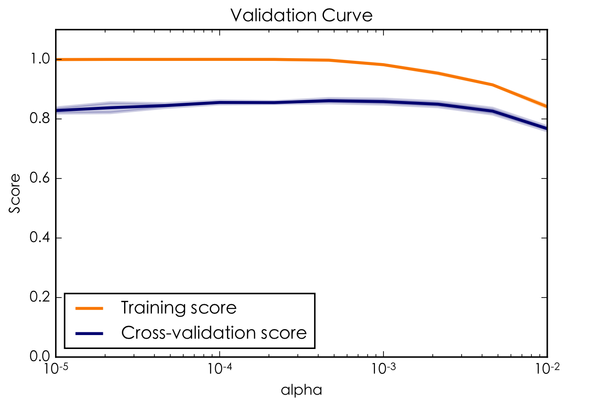

# Machine Learning Projects

> Any intelligent fool can make things bigger and more complex. It takes a touch of genius — and a lot of courage — to move in the opposite direction.

## Problem Setup 
In ML competitions, this step is usually done by competition hoster or data provider.
* Identify the problem and how to address it using machine learning
* Collect the appropriate data
* Clean and transform the data, and split the data into training and test datasets
* Setup evaluation metrics. In a competition, calculate scores for some fake senarios to know what it feels like.

## Data Exploration
There's no standard way. Common choices are making plots to visualize the dataset and view some summary statistics. Problems found in data exploration can guide data preprocessing.
Check out these handy python libraries/tools for data exploration: [Superset](https://github.com/airbnb/superset).
Possible choices:
* `data.head()`, `data.info()`, `data.describe()`
* numerical attributes: 
scatter plot: `sns.jointplot(x='attr1',y='attr2',data=X, kind='scatter', hue='label')`
distribution plot: `sns.distplot(X['attr'], kde=False, bins=30, color='darkred', hue='label')`
matrix plot of correlation matrix: `sns.heatmap(data.corr(), annot=True)`
on all numerical attributes: `sns.pairplot(X, hue='label')` 
* categorical attributes & classification label:
`sns.countplot(x='attr/label', hue='attr/label', data=X)`
`sns.boxplot(x="cat_attr", y="num_attr", hue="cat_attr", data=X)`
`sns.violinplot(x="cat_attr", y="num_attr", hue='cat_attr', data=X, split=True)`
* t-SNE: read [How to Use t-SNE Effectively](http://distill.pub/2016/misread-tsne/)

## Validation Setup
* use held-out validation (development set) or cross validation in training set. The evaluation metric should match the one used in the final test set. Pay attention to the time relation in data for dev set selection. 
* by public leaderboard or dashboard in a competition.

```python
from sklearn.model_selection import train_test_split
# for np.array
X_train, X_dev, y_train, y_dev = train_test_split(
  X, y, test_size=0.2, random_state=101)
# for pd.DataFrame
np.random.seed(101)
shuffle = lambda df: df.reindex(np.random.permutation(df.index))

from sklearn.model_selection import cross_val_score
cross_val_score(clf, X, y, cv=5)
```
## Data Preprocessing
### Data cleaning
#### fill in missing values
Quick look at where the missing value (in the form of NaN) is:
`sns.heatmap(X.isnull(), yticklabels=False, cbar=False, cmap='viridis')`
Use data plots to further check wheter zero is used as a representation of missing value.
A handy python library: [missingno](https://github.com/ResidentMario/missingno).
Common ways for missing value filling:
  * use the attribute mean or most probable value
  * use a learning algorithm to predict the missing values (can use dev/test data to build the model if the class label is not included in the model)
  * if a large proportion of data in a column is missing, we can simply drop this column or change it to another feature like "xxx Known: 1 or 0"

#### handling incorrect and inconsistent entries
The safe way to do this is by domain knowledge, for example, if the country field is “United States,” then the city field cannot be “Shanghai”. Data-centric methods for cleaning can sometimes be dangerous because they can result in the removal of useful knowledge from the underlying system. Thus any detected outlier may need to be manually examined before it is discarded. Data-centric methods include:
* group values in clusters and then detect and remove outliers 
* sort the attribute values and partition them into bins and then smooth the noisy data by bin mean, bin median, or bin boundaries.

```python
# remove duplication
rm_dup = lambda df: df[~df.index.duplicated(keep='first')]
# clean string data (not dealing with '\r' may cause implicit error in to_csv())
clean_str = lambda s: re.sub('[ \r\n\t]+', '', s)
```

### Feature Construction
This step is always done manually, and based on the understanding of the data with intuition and creativity. Once you spot a trend/pattern in data exploration, try to convert it to a feature.
* $x_i\pm x_j$ 
* $x_i\times x_j$ e.g. construct area by length $\times$ width
* $x_i^2$
* $\log x_i$
* parse date string into year, month, day, weekday, hour, day/night... 

### Data Transformation
#### Normalization
* z-score normalization (standardization): substracted by mean and then divided by standard deviation
* min-max normalization: less robust

```python
from sklearn.preprocessing import RobustScaler
scaler = RobustScaler()
X = scaler.fit_transform(X)
```

#### Discretization
Discretization transforms a numeric attribute into a discrete one by creating a set of contiguous intervals that spans the range of the attribute’s values.
* unsupervised discretization
  * equal-width discretization 
  * equal-frequency discretization
  * $\mu$-law companding transformation 
* supervised discretization
  * Chi merge 

#### Binarization
Because binary data is a special form of both numeric and categorical data, it is possible to convert the categorical attributes to binary form and then use numeric algorithms on the binarized data. These variables are also called "dummy variables".
```python
# in Numpy
def onehot(X, cat_features='all'): # or boolean mask 
    enc = OneHotEncoder(categorical_features=cat_features, sparse=False)
    print("enc.n_values_ is:", enc.n_values_)
    print("enc.feature_indices_ is:", enc.feature_indices_)
    return enc.fit_transform(X)
# Warning: `OneHotEncoder` can only transform "dense" integers
# [[100,200],[200,300]] will be turned into (2,300)
# in Pandas
sex = pd.get_dummies(train['Sex'], drop_first=True, prefix='Sex')
train.drop(['Sex'], axis=1, inplace=True)
train = pd.concat([train, sex], axis=1)
```

#### Symbolic Aggregate Approximation (SAX)
SAX converts time-series data to discrete sequence data, which is done by window-based averaging following by equi-depth discretization. The interval boundaries are esitimated with a Gaussian assumption in a stream scenario. The number of intervals are typically 3~10.
#### DWT & DFT
Discrete wavelet transform (DWT) and discrete Fourier transform (DFT) convert time series to numeric data, which enable the use of multidimensional algorithms for time-series data. If desired, a subset of the largest coefficients may be used to reduce the data size. The common property of these transforms is that the various coefficients are no longer as dependency oriented as the original time-series values.

Discrete sequence can be converted to numeric data by these two steps: first, convert the discrete sequence to a set of binary time series, where the number of time series is equal to the number of distinct symbols; Second, map each binary time series into a multidimensional vector using the wavelet transform and catenate them.

### Feature selection
The feature selection phase is often highly dependent on the specific analytical problem being solved. In some cases, the feature selection process can even be tightly integrated with the specific algorithm or methodology being used. Although the feature selection phase is usually performed before applying the specific algorithm at hand, it should not be considered merely a part of data preprocessing.
#### Univariate feature selection
  * Chi square ([code](resources/chi2.py))
  * correlation coefficient
  * information gain

#### Recursive feature selection
Repeatedly build a model and eliminate the weakest features in every step. For example, train a SVM and eliminate the feature with the smallest absolute weight in each round, or train a Random Forest and eliminated the feature ranked lowest.

## Architecture Design
First try out the recommended models in [choosing the right estimator in scikit-learn](http://scikit-learn.org/stable/tutorial/machine_learning_map/).
Avoid repeated training and save the model:
```python
from sklearn.externals import joblib
joblib.dump(clf, 'models/model_name.pkl') 
clf = joblib.load('models/model_name.pkl') 
```
For non-sklearn parts check out [What can be pickled and unpickled?](https://docs.python.org/3/library/pickle.html#what-can-be-pickled-and-unpickled) [code example](http://stackoverflow.com/questions/4529815/saving-an-object-data-persistence)
### Frequently-used models
* [MultinomialNB](http://scikit-learn.org/stable/modules/generated/sklearn.naive_bayes.MultinomialNB.html) 
* [LogisticRegression](http://scikit-learn.org/stable/modules/generated/sklearn.linear_model.LogisticRegression.html)
* [SGDClassifier](http://scikit-learn.org/stable/modules/generated/sklearn.linear_model.SGDClassifier.html#sklearn.linear_model.SGDClassifier)

```python
from sklearn.linear_model import LogisticRegression
LogisticRegression(solver='sag',multi_class='multinomial', n_jobs=-1,C=1)
from sklearn.naive_bayes import MultinomialNB
from sklearn.svm import LinearSVC
from sklearn.linear_model import SGDClassifier
svm = SGDClassifier(loss='modified_huber', penalty='l2', alpha=0.001)
```
* [Awesome XGBoost](https://github.com/dmlc/xgboost/blob/master/demo/README.md), [Complete Guide to Parameter Tuning in XGBoost](https://www.analyticsvidhya.com/blog/2016/03/complete-guide-parameter-tuning-xgboost-with-codes-python/)

### Ensemble
* voting

```python
prediction = np.apply_along_axis(
  lambda x: np.argmax(np.bincount(x, weights=None)), axis=1,
  arr=predictions.astype(int)) # labels must be convertable to int
```
* stacking

### Clustering
* Cluster the dataset or use one nomial feature as cluster label, then train a different model in each cluster.
* Cluster the dataset and treat the cluster label as a new feature

### Multi-class classification
* Ordered One-vs-Rest: classify classes with high (near 100%) accuracy first. Then use traditional OVO or OVR scheme to deal with the more difficult ones.

## Model tuning:
### grid search

```python
from sklearn.grid_search import GridSearchCV
param_grid = {
  'C': [0.1, 1, 10, 100, 1000], 
  'gamma': [1, 0.1, 0.01, 0.001, 0.0001], 
  'kernel': ['rbf']} 
grid = GridSearchCV(SVC(), param_grid, refit=True, verbose=3) # 0~3
grid.fit(X_train,y_train)
print(grid.best_params_)
# Then you can run predictions directly on this grid object.
```
or plot the [validation curve](resources/val_curve.py):
<div align="center">

</div>

### random search
<div align="center">

</div>

> Don't simply select a model by its default parameters.

## Error Analysis
### Classification
* sampling, say 100 misclassified samples, manually look at the data and summarize types of errors
* more advanced manual peeking:
  * A few correct samples at random.
  * A few incorrect samples at random.
  * Most confident correct samples (for each class) 
  * Most confident incorrect samples (for each class)
  * Most uncertain samples
* look at the [matrix plot of the confusion matrix](resources/confusion_matrix.py) ([example plot](resources/confusion_matrix.svg))
* ROC, AUC for binary classification
* [top k error](resources/topk.py)
* a quick view for binary classification:
```python
from sklearn.metrics import classification_report
print(classification_report(y_dev, predictions))
```


### Regression
* look at the scatter plot of predicted and actual values: `plt.scatter(y_dev, predictions)`
* look at the residual histogram: `sns.distplot((y_dev-predictions), bins=50) `

## Useful Python Packages
* [metric-learn](https://github.com/all-umass/metric-learn)
* [approximate nearest neighbours](https://github.com/spotify/annoy)
* [text distance](https://github.com/jamesturk/jellyfish)

## Reference
- Book: Data Mining - The Textbook
- Book: Beating Kaggle the Easy Way
- Source code of Scikit-Learn
- Udemy course: Data Mining and Machine Learning Bootcamp
- [Exclusive Interview with SRK, Sr. Data Scientist, Kaggle Rank 25](https://www.analyticsvidhya.com/blog/2015/11/exclusive-interview-srk-sr-data-scientist-kaggle-rank-25/)
- [Interview with data scientist and top Kaggler, Mr. Steve Donoho](https://www.analyticsvidhya.com/blog/2013/11/interview-top-data-scientist-kaggler-mr-steve-donoho/)