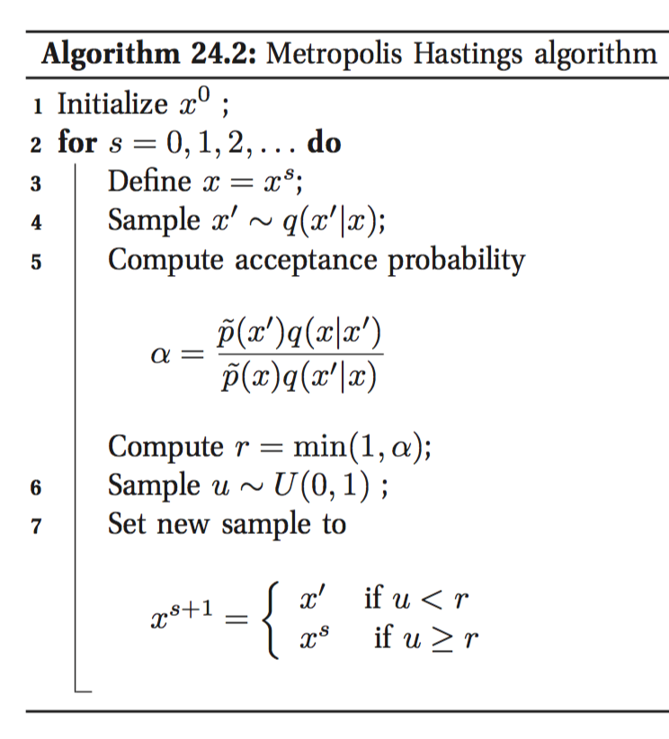

# Metropolis-Hastings Algorithm

Our target:
$$
I=\int h(x)f(x)\mathrm{d}x=E_f[h(x)]
$$
It's hard to compute it directly. Aprroximation:
$$
\hat I=\frac{1}{N}\sum_{i=1}^Nh(x_i)
$$
where $x_1,\dots,x_N$ are sampled from $f$.
In order to sample from f, we generate a Markov chain $x_1,x_2,\dots$, whose stationary distribution is $f$, and draw samples from the chain.
In order to generate the desired Markov chain, we use the Metropolis-Hastings Algorithm:

which ensures the fraction of time spent in each state $x$ is proportional to $p^*(x)$. 

$\widetilde p(x)$ is unnormalized $p^*(x)$. $q$ is called a **kernel** or a **proposal distribution**, which propose a value that can be accepted or reject.
Why it works: satisfying detailed balance.

In practice it's hard to tell whether the Markov chain has reached its stationary distribution (computationally intractable), though there are a handful of diagnosing tricks. Samples collected before the chain has reached its stationary distribution do not come from $p^*$, and are usually thrown away. The initial period, whose samples will be ignored, is called the **burn-in phase**.

special case: Gibbs sampling.
$$
q(x'|x)=p(x_i'|x_{-i})\mathrm{II}(x'_{-i}=x_{-i})
$$
In Gibbs sampling, the acceptance probability $\alpha\equiv1$.

### reference
Book: Machine Learning - A Probabilistic Perspective(Chapter 24)
