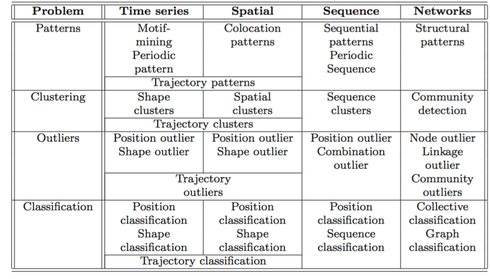

# Types of ML Problems

### Nondependency-oriented data
The data records do not have any specified dependencies between either the data items or the attributes
* Mixed Attribute Data
* Quantitative Data
* Categorical Data
* Binary and Set Data
* Text Data

Nondependency-oriented data can be easily represented by a data matrix. Broadly speaking, data mining is all about finding summary relationships between the entries in the data matrix that are either unusually frequent or unusually infrequent. Relationships between data items are one of two kinds:
* Relationships between columns
  * association pattern mining: the frequent or infrequent relationships between columns
  * classification/regression: how other columns relate to a special column
* Relationships between rows
  * clustering: similar subsets of rows
  * outlier analysis: unusual rows

### Dependency-oriented data
implicit or explicit relationships may exist between data items. 
* _Contextual attributes_ are the attributes that define the context on the basis of which the implicit dependencies occur in the data, e.g. time stamps. 
  * They may not be explicitly used, e.g. position indices in strings. 
  * More than one contextual attributes may exist, e.g. in spatial data.
* _Behavioral attributes_ represent the values that are measured in a particular context, e.g. temperature recorded by a sensor.

Types of dependency-oriented data are:
* Time-Series (Continuous Sequence) Data
* Discrete Sequences Data (Strings)
* Spatial Data: geographic, image...
* Spatiotemporal Data
  * dynamic geographic, video...
  * trajectory
* Network and Graph Data

### Reference 
Data Mining: The Textbook