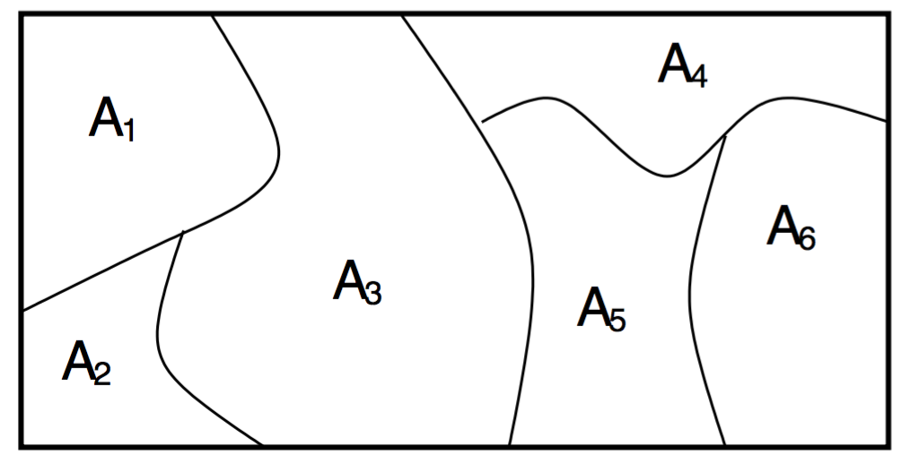
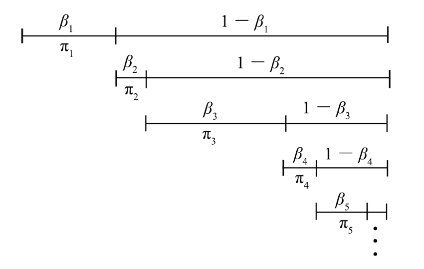
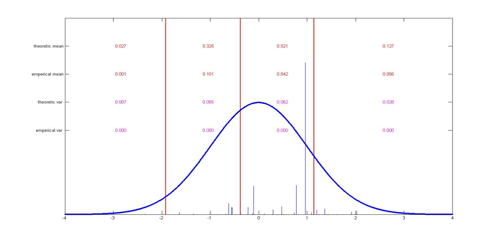
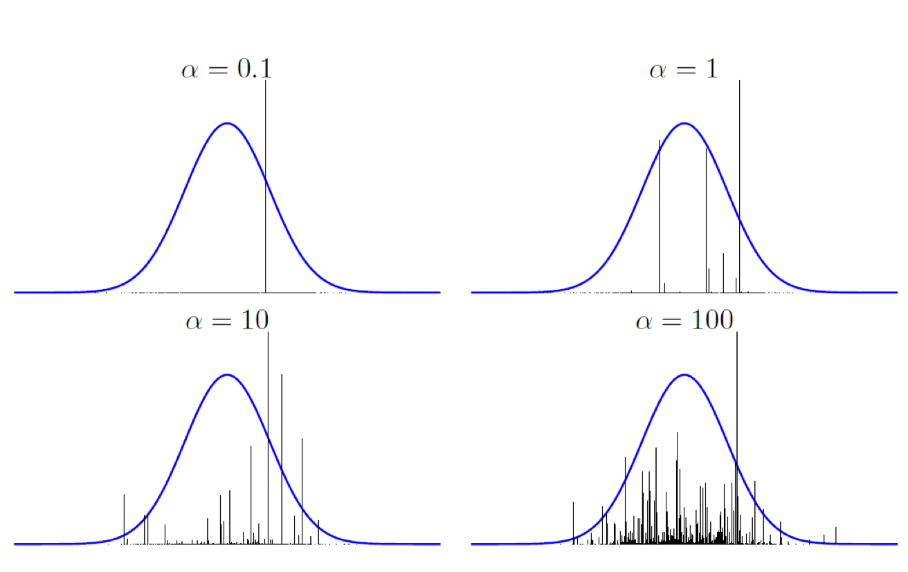

# Dirichlet Process

A Dirichlet process (DP) is a random probability measure $G$ over measure space $\Theta$ such that for **any** finite set of measurable sets $A_1,\dots,A_K$ partitioning $\Theta$, we have
$$
(G(A_1),\dots,G(A_K )) \sim \operatorname{Dir}(\alpha H(A_1),\dots, \alpha H(A_K ))
$$
* $H$: Base distribution
* $\alpha$: concentration parameter

Properties (derive from the mean and variance of the Dirichlet distribution)
$$
\operatorname{E}(G(A_i))=H(A_i)
$$
$$
\operatorname{Var}(G(A_i))=\frac{H(A_i)(1-H(A_i))}{\alpha+1}
$$

* $\alpha\to \infty$: $\operatorname{Var}(G(A_i))\to 0$, $G=H$.
* $\alpha\to 0$: $\operatorname{Var}(G(A_i))\to 0$, $\operatorname{Var}(G(A_i))\to H(A_i)(1-H(A_i))$ , similar to Bernoulli distribution.

Constructive definition: Stick-breaking constructioin
* $\beta_k\sim \operatorname{Beta}(1,\alpha)$
* $\theta_k\sim H$
* $\pi_k=\beta_k\prod_{l=1}^{k-1}(1-\beta_l)$
* $G=\sum_{k=1}^\infty\pi_k\delta_{\theta_k}$

The result stick-breaking sampling has the property:
$$
(\sum_{A_1}\pi_{l_1},\dots,\sum_{A_K}\pi_{l_K}) \sim \operatorname{Dir}(\alpha H(A_1),\dots, \alpha H(A_K ))
$$

Examples of different $\alpha$:

Posterior:
$$
G|\theta_1,\theta_2,\dots,\theta_n\sim \operatorname{DP}\left(
\alpha+n,\frac{\alpha H+\sum_{i=1}^n \delta_{\theta_i}}{\alpha +n}
\right)
$$
Prediction/Drawing samples:
$$
\begin{align}
P(\theta_{n+1}|\theta_1,\theta_2,\dots,\theta_n)
&{}=\operatorname E(G|\theta_1,\theta_2,\dots,\theta_n)\\
&{}=\frac{\alpha}{\alpha+n}H+\frac{\sum_{i=1}^n \delta_{\theta_i}}{\alpha+n}
\end{align}
$$
The prediction can be seen as a **Chinese Restaurant Process**:
At any positive-integer time $n$, the value of the process is a partition $B_n$ of the set {1, 2, 3, ... , n}, whose probability distribution is determined as follows. At time $n = 1$, the trivial partition { {1} } is obtained with probability 1. At time n + 1 the element n + 1 is either:
* added to one of the blocks of the partition $B_n$, where each block is chosen with probability $|b|/(n + 1)$ where $|b|$ is the size of the block (i.e. number of elements), or
* added to the partition $B_n$ as a new singleton block, with probability $1/(n + 1)$.

### Reference
- Nonparametric Baysian Models: http://videolectures.net/mlss09uk_teh_nbm/
0 Chinese restaurant process: https://en.wikipedia.org/wiki/Chinese_restaurant_process
