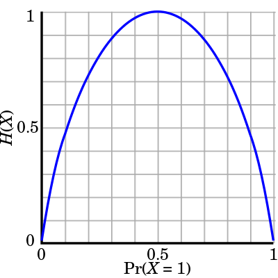

# Entropy

Entropy of a random variable indicates how hard to predict the value of the variable or the uncertainty of the variable. It’s also called “expected surprisal”. 

$$
\begin{align*}
H(x) &= -\int p(x)\log p(x)\mathrm{d}x \\\\
&= -\operatorname{E}\left[ \log p(x)\right]
\end{align*}
$$

---
Illustration: Entropy of a coin flip

### Reference
Entropy: [https://en.wikipedia.org/wiki/Entropy](https://en.wikipedia.org/wiki/Entropy)
