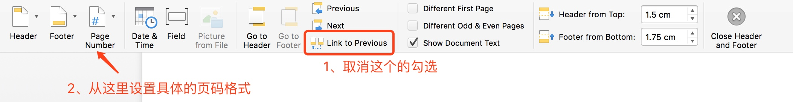

### Alfred
- [official guide](https://www.alfredapp.com/)
- [powerful plugins](https://github.com/zenorocha/alfred-workflows)
### vscode gives false positive warnings on importing modules
Change linter settings:
```json
"python.linting.pylintArgs": [
  "--disable=C,R,W,E0611,E0401,E1101",
  "--enable=unreachable,duplicate-key,unnecessary-semicolon,global-variable-not-assigned,unused-variable,binary-op-exception,bad-format-string,anomalous-backslash-in-string,bad-open-mode"
]
```
### Use IPython as pdb interactive shell
Edit or create `~/.pdbrc`:
```
import IPython 
# Interactive shell
alias interacti IPython.embed()
```
Use `interacti` instead of `interact` to use IPython.

### Use GNU command line tools in MacOS
`brew install coreutils`. Then all commands will be installed with the prefix 'g'. For example, "split" will be "gsplit".
### Brew is slow in China
Mirrors in China:
- [USTC](https://mirrors.ustc.edu.cn) ([guide](https://lug.ustc.edu.cn/wiki/mirrors/help/brew.git))
- [Tsinghua](https://mirrors.tuna.tsinghua.edu.cn/help/homebrew/)

If still not successful, first uninstall brew using:
```sh
/usr/bin/ruby -e "$(curl -fsSL https://raw.githubusercontent.com/Homebrew/install/master/uninstall)"
```
Then reinstall brew by the following commands:
```sh
cd /usr/local/
sudo git clone https://mirrors.tuna.tsinghua.edu.cn/git/homebrew/brew.git
sudo chown -R $(whoami) brew/
echo "export PATH=/usr/local/brew/bin:$PATH" >> ~/.bash_profile
cd brew && mkdir -p Library/Taps/homebrew/ && cd Library/Taps/homebrew/
git clone https://mirrors.tuna.tsinghua.edu.cn/git/homebrew/homebrew-core.git
brew update
```
If brew update is still not successful, update manually by:
```
cd "$(brew --repo)"
git pull

cd "$(brew --repo)/Library/Taps/homebrew/homebrew-core"
git pull
```

Example usage of homebrew:
```sh
brew install cloc
brew upgrade mongodb
brew remove cloc
```

### Install fonts

Move font files to `/Library/Fonts/`


### "no such kernel named python3" when runnning jupyter in Pycharm

```python
conda update nb_conda nb_conda_kernels nb_anacondacloud
```

### Install Spark & PySpark

After installing Java & Scala,

```sh
brew install apache-spark
```

Run PySpark in Jupyter notebook:

```sh
export PYSPARK_DRIVER_PYTHON=jupyter
export PYSPARK_DRIVER_PYTHON_OPTS=notebook
pyspark
```

now there's a SparkContext named `spark` in the notebook.

### Mac突然黑屏按键无法唤醒

移开Mac附近带磁性的东西，尤其是带磁扣的电脑包...参考[豆瓣讨论](https://www.douban.com/group/topic/42531618/)。

### Mac触摸板突然按不下去

关机，然后同时按住Command+alt+r+p+启动键，然后等很久再松开，就好了。参考[知乎答案](https://www.zhihu.com/question/22396705)。

### 设置Word从指定页码开始编页 [参考文档](https://support.office.com/zh-cn/article/%E5%BC%80%E5%A7%8B%E9%A1%B5%E7%A0%81%E7%BC%96%E5%8F%B7%E5%9C%A8-Word-%E4%B8%AD%E6%96%87%E6%A1%A3%E7%9A%84%E5%90%8E%E9%9D%A2-for-Mac-678ab67a-d593-4a47-ae35-8ffed9573132?ui=zh-CN&rs=zh-CN&ad=CN)

1. 光标放在实际上的第一页开头，Insert-Break-Section Break(Next Page)，此时出现一个空白页
2. 双击空白页底部，进入编辑页脚的模式：
3. 关闭编辑页脚的模式
4. 光标放在实际上的第一页开头，从后往前删掉这个空白页。


### 安装cx\_Oracle

登陆oracle官网，从[该页面](http://www.oracle.com/technetwork/topics/intel-macsoft-096467.html)下载Mac版本的[instantclient-basic](http://download.oracle.com/otn/mac/instantclient/121020/instantclient-basic-macos.x64-12.1.0.2.0.zip)、 [instantclient-sdk](http://download.oracle.com/otn/mac/instantclient/121020/instantclient-sdk-macos.x64-12.1.0.2.0.zip)。

建立文件夹/usr/runqi/oracle，解压文件，将两个都叫instantclient\_12\_1的文件夹下面的内容拷贝到该文件夹。再原地解压.../oracle/sdk/ottclasses.zip。在oracle文件夹下创造两个超链接：

```sh
ln -s libclntsh.dylib.12.1 libclntsh.dylib
ln -s libocci.dylib.12.1 libocci.dylib
```

创建系统变量并source：

```sh
export ORACLE_HOME=/usr/runqi/oracle
export DYLD_LIBRARY_PATH=$ORACLE_HOME
export LD_LIBRARY_PATH=$ORACLE_HOME
```

检查以下两个都有返回值：

```sh
echo $ORACLE_HOME
sudo env | grep ORACLE_HOME
```

如果后一个没有返回值，输入sudo visudo，加入这么一行再做检查：

```sh
Defaults env_keep += "ORACLE_HOME"
```

最后用pip进行安装：

```sh
env ARCHFLAGS="-arch x86_64" pip install cx_Oracle
```

### 安装Java大家族

Java, Scala, Groovy… <http://sdkman.io/>

### Matplotlib不能正常显示中文

```python
from matplotlib.font_manager import FontProperties
myfont = FontProperties(fname="/Library/Fonts/华文黑体.ttf")
sns.set(font=myfont.get_name()) # 纯matplotlib加入前两行就行
```

### 解压带中文的、windows过来的zip文件出现文件名乱码

App store下载The Unarchiver，并在文件信息里设置为解压.zip文件的默认程序。

### Jupyter Notebook／IPyton提示“ValueError: unknown locale: UTF-8”

打开Terminal，进入Preferences：


将图示的选项取消勾选。编辑.bash\_profile文件，加入：
```
export LANG=en\_US.UTF-8
```
回到命令行，执行`source ~/.bash_profile`。重启Jupyter Notebook即可。

### matlab 2015及以前的版本mex无法识别新版Xcode 7:

<http://www.mathworks.com/matlabcentral/answers/246507-why-can-t-mex-find-a-supported-compiler-in-matlab-r2015b-after-i-upgraded-to-xcode-7-0>

### 配置git全局忽略文件：

创建文件`.gitignore_global`：

```
# Compliled source
*.class
*.dll
*.exe
*.o
*.so

#Packages
*.7z
*.dmg
*.gz
*.iso
*.rar
*.tar
*.zip
*.jar

# OS generated files
.DS_Store
.DS_Store?
.Trashes
.Spotlight-V100
ehthumbs.db
Thumbs.db
```

使用命令：

```sh
git config --global core.excludesfile ./.gitignore_global
```

### 更改xcode版本

1. Log in to <https://developer.apple.com/downloads/>
2. Download CLT (Command Line Tools) for XCode 7.3
3. Install CLT
4. Run `sudo xcode-select --switch /Library/Developer/CommandLineTools`
5. Verify that clang has been downgraded via `clang —version`

### 安装TensorFlow

(python 3.5, CPU only)

```sh
$ export TF_BINARY_URL=https://storage.googleapis.com/tensorflow/mac/cpu/tensorflow-0.11.0rc0-py3-none-any.whl
sudo pip install --ignore-installed --upgrade $TF_BINARY_URL
```

注意`--ignore-installed`一定要加上（默认教程里没有）。安装文件地址可以再去官网看最新版。

### 查看Java安装路径

```sh
/usr/libexec/java_home -v 1.8
/usr/libexec/java_home -v 1.7
```

### 解决gephi 0.8.2的兼容性

参见[这里](https://medium.com/coder-snorts/gephi-is-broken-on-mac-os-97fbaef4305e#.1r8imyolg)。

### remove all ".DS\_Store" in a folder

```sh
find ./ -name ".DS_Store" -depth -exec rm {} \;
```
