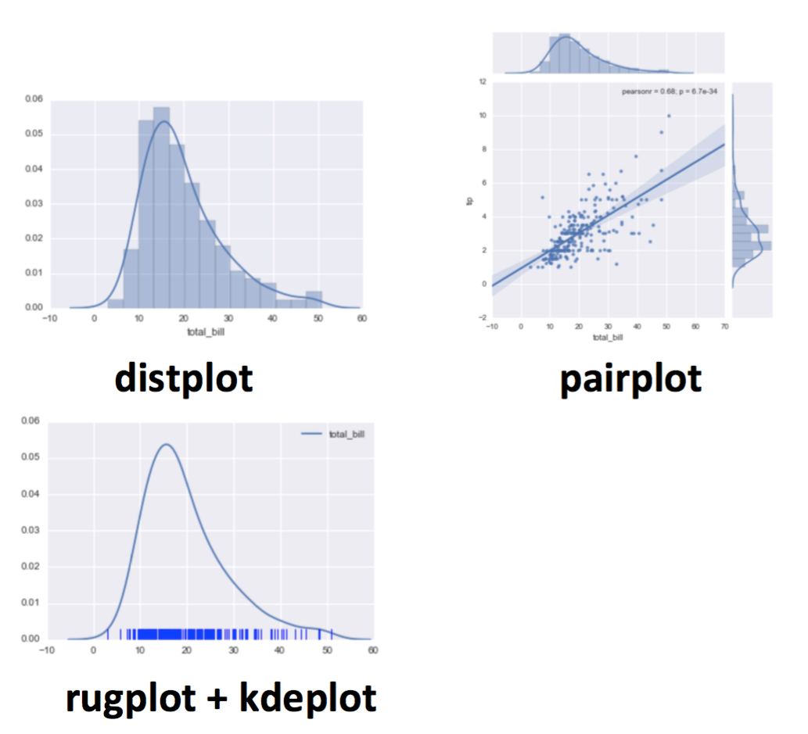
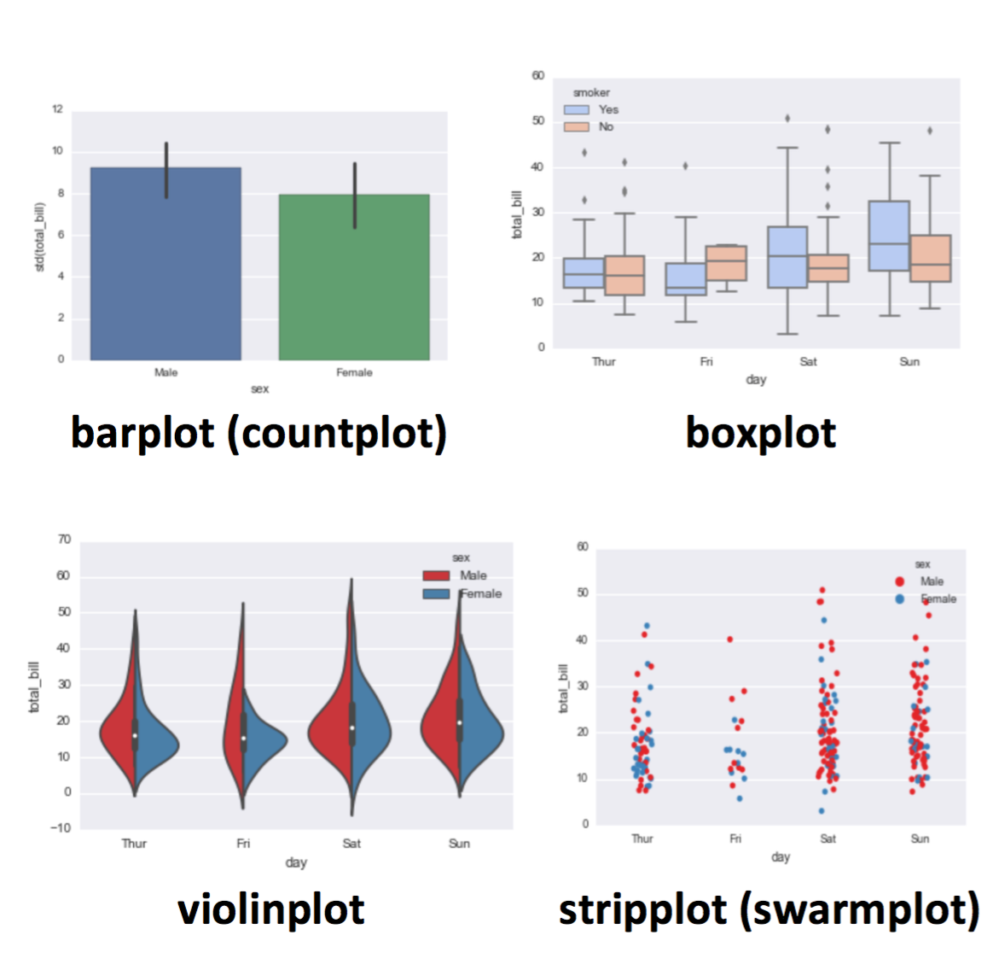
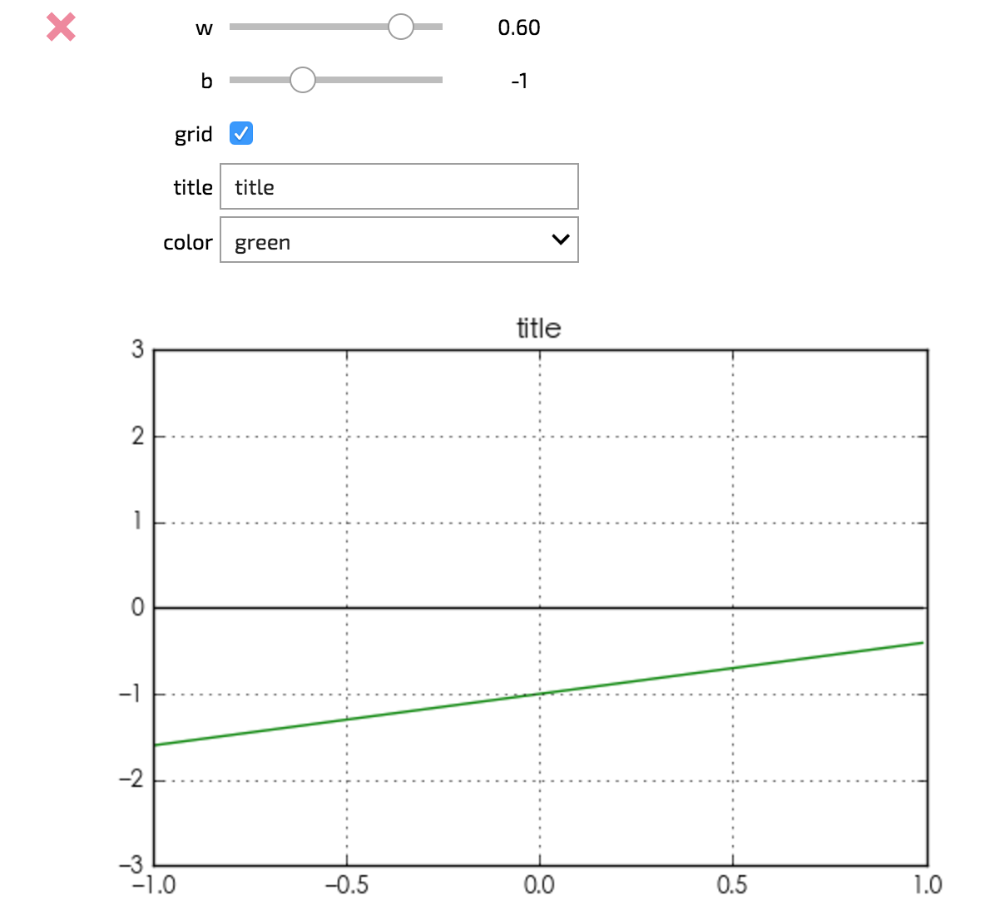
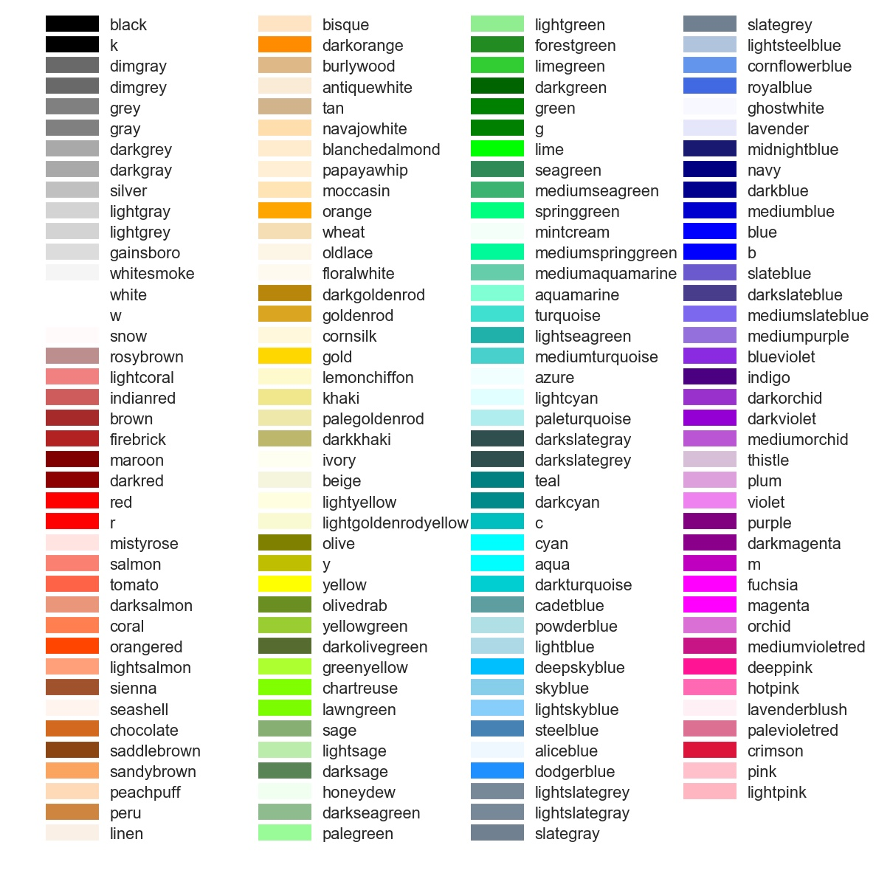

## opencv
```python
import cv2
img = cv2.imread('xxx.png') # `img` is a numpy array
height, width, channel = img.shape  # color in channels: BGR
# img = cv2.cvtColor(img, cv2.COLOR_BGR2RGB)
cv2.rectangle(img, (xmin, ymin), (xmax, ymax), color=(255, 255, 255), thickness=2)
cv2.putText(img, '%.2f' % box['score'], (xmin, ymax), # put text in lower left corner of the rect
            fontFace=cv2.FONT_HERSHEY_SIMPLEX, fontScale=0.5, color=(255, 255, 255), thickness=1) 
cv2.line(img, (100, 100), (100, 200), color=(32, 32, 32), thickness=2)
cv2.imshow('window_title', img)
cv2.waitkey(0) # in milliseconds, 0 means wait forever, return ASCII code (int)
cv2.imwrite('xxx.jpg', img)
```
matplotlib
----------

```python
import matplotlib.pyplot as plt
```

`%matplotlib inline` if you're in ipython notebook, otherwise use `plt.show()` at the end.

use `plt.savefig('filename.png')` to save your figure to disk.

### single chart

```python
plt.plot(x, y, 'r') # 'r' is the color red
plt.xlabel('X Axis Title Here')
plt.ylabel('Y Axis Title Here')
plt.title('String Title Here')
```

### multiple charts

```python
plt.subplot(1,2,1)
plt.plot(x, y, 'r--') # More on color options later
plt.subplot(1,2,2)
plt.plot(y, x, 'g*-');
```

### get objects

(auto)

```python
fig, axes = plt.subplots(nrows=1, ncols=2, figsize=(8,4)) # figsize can be omitted
```

(manual)

```python
fig = plt.figure(figsize=(8,4)) # figsize can be omitted
axes1 = fig.add_axes([0.1, 0.1, 0.8, 0.8]) # main axes
axes2 = fig.add_axes([0.2, 0.5, 0.4, 0.3]) # inset axes
```

(get current)

```python
fig = plt.gcf()
ax = plt.gca()
# or
fig, ax = plt.subplots()
```

### methods

```python
ax.plot(x, y, 'b.-', label='A')
#                        line width, style, transparency
ax.plot(x2, y2, color='blue', lw=3, ls='--', alpha=0.5, label='B') 
ax.legend(['name1','name2'], loc=1) # or `loc='upper right'`.
ax.set_xlabel('xlabel')
ax.set_ylabel('ylabel')
ax.set_title('title')
# legend code:
# best -- 0
# upper right -- 1
# upper left -- 2
# lower left -- 3
# lower right -- 4
# right -- 5
# center left -- 6
# center right -- 7
# lower center -- 8
# upper center -- 9
# center -- 10

ax.axis('tight') # auto
ax.set_xlim([2, 5]) # manual
ax.set_ylim([0, 60])
ax.set_yscale('log')

# use LaTeX formatted labels
# see more in http://matplotlib.org/api/ticker_api.html
ax.set_xticks([1, 2, 3, 4, 5])
ax.set_xticklabels([r'$\alpha$', r'$\beta$', r'$\gamma$', r'$\delta$', r'$\epsilon$'], fontsize=18)
yticks = [0, 50, 100, 150]
ax.set_yticks(yticks)
ax.set_yticklabels(["$%.1f$" % y for y in yticks], fontsize=18); 

ax.grid(True)
ax.grid(color='b', alpha=0.5, linestyle='dashed', linewidth=0.5)
# text annotation
ax.text(0.15, 0.2, r"$y=x^2$", fontsize=20, color="blue", bbox=dict(facecolor="grey", alpha=0.5))
# Chinese (or other foreign) text
from matplotlib.font_manager import FontProperties
fp = FontProperties(fname='/usr/share/fonts/PingFang.ttc')
ax.text(..., fontproperties=fp)
font = {'family': 'serif', # "Times New Roman"
        'color':  'darkred',
        'weight': 'bold',
        'size': 20}
plt.text(1, 140, f'iter={i}', fontdict=font)

plt.plot((x1, x2), (y1, y2), 'k-') # draw a line (can be vertical)
# draw a rectangle
import matplotlib
ax = plt.gca()
r = matplotlib.patches.Rectangle((.5, .5), .25, .1, fill=False,  # lower left at (.5,.5), h, w
                                 edgecolor=(0,1,1), linewidth=1.5)
ax.add_artist(r)
```

```python
fig.savefig("filename.png", dpi=200)
```

### histagram 

[documentation](http://matplotlib.org/api/pyplot_api.html#matplotlib.pyplot.hist)

```python
counts, boundries, _ = plt.hist(arr) # auto mode
plt.hist(arr, bins=50)
plt.hist(arr, bins=np.arange(arr.min, arr.max()+2, 5)) # set boundry [l,r)
plt.hist(arr, log=True) # log scale on y
plt.hist(arr, range=(min_val, max_val)) # ignore values outside the range
# If data is out of bounds it will be added to the nearest bin, be careful!
# Available auto bin size estimators: https://docs.scipy.org/doc/numpy/reference/generated/numpy.histogram.html

# if the data is discrete, use the following in Pandas:
column.value_counts().plot.bar()
```

[example for annimating histogram change](resources/video.py)

### Venn Diagram

`pip install matplotlib_venn`

```python
from matplotlib_venn import venn2, venn3
venn2([set_1, set_2], set_labels = ('labelA', 'labelB')) # use venn3 for 3 sets
```

### 2 scales (different y axis) 

[example](https://matplotlib.org/examples/api/two_scales.html)

seaborn 
--------

[homepage](http://seaborn.pydata.org)

```python
import seaborn as sns
%matplotlib inline

tips = sns.load_dataset('tips')
flights = sns.load_dataset('flights')
iris = sns.load_dataset('iris')
```

### **distribution plots**


```python
sns.distplot(tips['total_bill'])
sns.distplot(tips['total_bill'],kde=False,bins=30)

sns.jointplot(x='total_bill',y='tip',data=tips,kind='scatter')
sns.jointplot(x='total_bill',y='tip',data=tips,kind='hex') # hex areas
sns.jointplot(x='total_bill',y='tip',data=tips,kind='reg') # regression

# pairwise relationships across an entire dataframe for the *numerical* columns
sns.pairplot(tips) 
# color hue for categorical columns
sns.pairplot(tips, hue='sex',palette='coolwarm')

sns.kdeplot(tips['total_bill']) # Kernel Density Estimation plots
sns.rugplot(tips['total_bill']) # a dash mark for every point on a univariate distribution
```

### categorical plots


```python
sns.barplot(x='sex',y='total_bill',data=tips)
sns.barplot(x='sex',y='total_bill',data=tips,estimator=np.std)
sns.countplot(x='sex',data=tips)

# The box shows the quartiles of the dataset while the whiskers extend to show the rest of the distribution, except for points that are determined to be “outliers” using a method that is a function of the inter-quartile range.
sns.boxplot(x="day", y="total_bill", data=tips, palette='rainbow')
# include another categorical variable
sns.boxplot(x="day", y="total_bill", hue="smoker", data=tips, palette="coolwarm")
# for entire dataframe
sns.boxplot(data=tips,palette='rainbow',orient='h')

# the violin plot features a kernel density estimation of the underlying distribution.
sns.violinplot(x="day", y="total_bill", data=tips,palette='rainbow')
# include another categorical variable, parallel
sns.violinplot(x="day", y="total_bill", data=tips, hue='sex',palette='Set1')
# non-symetric
sns.violinplot(x="day", y="total_bill", data=tips,hue='sex',split=True,palette='Set1')

# show all observations (not for huge amount of data!)
sns.stripplot(x="day", y="total_bill", data=tips) # in a vertical line
sns.stripplot(x="day", y="total_bill", data=tips,jitter=True) # not all overlapped
sns.stripplot(x="day", y="total_bill", data=tips,jitter=True,hue='sex',palette='Set1')
sns.stripplot(x="day", y="total_bill", data=tips,jitter=True,hue='sex',palette='Set1',split=True) # split into 2 vertical lines
sns.swarmplot(x="day", y="total_bill", data=tips) # not overlapping at all
sns.swarmplot(x="day", y="total_bill",hue='sex',data=tips, palette="Set1", split=True)
# the two can be combined:
sns.violinplot(x="tip", y="day", data=tips,palette='rainbow')
sns.swarmplot(x="tip", y="day", data=tips,color='black',size=3)
```

### matrix plots

```python

sns.heatmap(tips.corr())
sns.heatmap(tips.corr(),cmap='coolwarm',annot=True) # will show values on the plot
pv = flights.pivot_table(values='passengers',index='month',columns='year')
sns.heatmap(pv)
sns.heatmap(pv,cmap='magma',linecolor='white',linewidths=1)

sns.clustermap(pv) # similar rows and columns will be put together
sns.clustermap(pvflights,cmap='coolwarm',standard_scale=1) # normalize to [0,1]
```

### regression plots

```python
sns.lmplot(x='total_bill',y='tip',data=tips)
sns.lmplot(x='total_bill',y='tip',data=tips,hue='sex')
sns.lmplot(x='total_bill',y='tip',data=tips,hue='sex',palette='coolwarm')
sns.lmplot(x='total_bill',y='tip',data=tips,hue='sex',palette='coolwarm',
           markers=['o','v'],scatter_kws={'s':100}) # size:100
           # details see: http://matplotlib.org/api/markers_api.html
sns.lmplot(x='total_bill',y='tip',data=tips,col='sex') # two seperate plots
sns.lmplot(x="total_bill", y="tip", row="sex", col="time",data=tips) # four
sns.lmplot(x='total_bill',y='tip',data=tips,col='day',hue='sex',palette='coolwarm',
          aspect=0.6,size=8)
```

### grids

```python
# general version of "pairplot"
g = sns.PairGrid(iris)
g.map_diag(plt.hist)
g.map_upper(plt.scatter)
g.map_lower(sns.kdeplot)

g = sns.FacetGrid(tips, col="time",  row="smoker")
g = g.map(plt.hist, "total_bill") # draw histograms for each catagory
g = sns.FacetGrid(tips, col="time",  row="smoker", hue='sex')
g = g.map(plt.scatter, "total_bill", "tip").add_legend()

# general version of "jointplot"
g = sns.JointGrid(x="total_bill", y="tip", data=tips)
g = g.plot(sns.regplot, sns.distplot)
```

Pandas (built-in)
-----------------

```python
plt.style.use('ggplot')
plt.style.use('bmh')

df['A'].hist()
df['A'].plot.hist(bins=50) # parameters same as plt.hist()

df['A'].plot.kde()

# NOTICE: these methods are also be called by Series objects
df.plot.density() # multiple lines with different colors

# area chart
df.plot.area(alpha=0.4) 

df.plot.bar() # x is index, y is value, category is column
df.plot.bar(stacked=True) 

df.plot.box() # by=...

# line chart
df.plot.line(x=df.index,y='B',figsize=(12,3),lw=1)

df.plot.scatter(x='A',y='B')
df.plot.scatter(x='A',y='B',c='C',cmap='coolwarm') # map color, or do sth like c='red'
df.plot.scatter(x='A',y='B',s=df1['C']*200) # map size

# alternative to scatter plot
df = pd.DataFrame(np.random.randn(1000, 2), columns=['a', 'b'])
df.plot.hexbin(x='a',y='b',gridsize=25,cmap='Oranges')
```

Plotly
------

Powerful interactive visualization tool. see <https://plot.ly/> 

Images
------

```python
from PIL import Image
Image.open(filename) # you should see it in a notebook
```

Jupyter Notebook Widgets [install guide](https://ipywidgets.readthedocs.io/en/latest/user_install.html)
-------------------------------------------------------------------------------------------------------

```python
from __future__ import print_function
from ipywidgets import interact, interactive, fixed, interact_manual
import ipywidgets as widgets
```

```python
def f(w,b,grid,title,color):
    plt.clf()
    x = np.arange(-1,1,0.01)
    plt.plot(x, w*x+b, color)
    plt.plot(x, np.zeros(x.shape), 'k')
    plt.axis([-1,1,-3,3])
    plt.grid(grid)
    plt.title(title)
# if you want to click a button and update, use `interact_manual`
interact(f, w=(-1.,1.,.1), b=(-3,3,1), grid=False, title='Enter title',
         color={'red':'r','blue':'b', 'green':'g'},continuous_update=False);
```


For more types of widgets, click [here](https://ipywidgets.readthedocs.io/en/latest/examples/Widget%20List.html).

Matplotlib Colortable
---------------------


## Other Resources
- [tutorial](http://www.labri.fr/perso/nrougier/teaching/matplotlib/) 
- [gallery](http://matplotlib.org/gallery.html) 
- [Choosing colormaps](http://matplotlib.org/users/colormaps.html) `xxx(cmap=‘cmapname’)`

Apply colormap manually:

```python
class MplColorHelper:
    def __init__(self, cmap_name, start_val, stop_val):
        self.cmap_name = cmap_name
        self.cmap = plt.get_cmap(cmap_name)
        self.norm = mpl.colors.Normalize(vmin=start_val, vmax=stop_val)
        self.scalarMap = cm.ScalarMappable(norm=self.norm, cmap=self.cmap)

    def get_rgb(self, val):
        return self.scalarMap.to_rgba(val)

x = np.random.uniform(0, 1, size=20)
y = np.random.uniform(0, 10, size=20)
COL = MplColorHelper('PiYG', 1, 9) # value outside (1,9) will be clipped
plt.scatter(x,y,s=300,c=COL.get_rgb(y))
```


